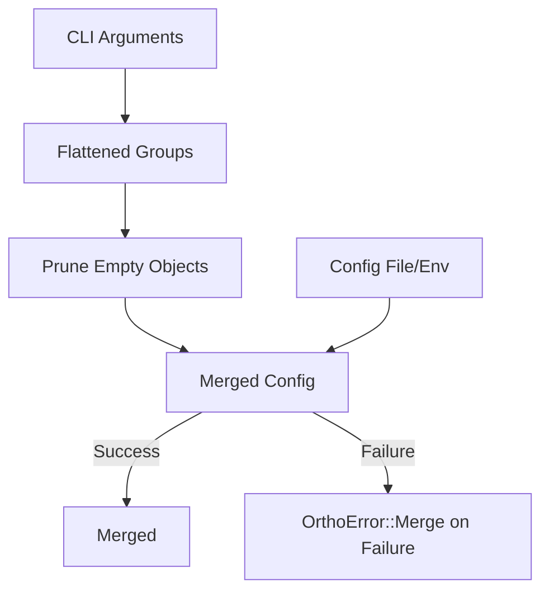
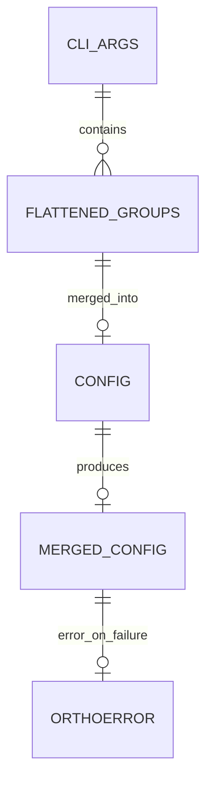

# Design Document: The `OrthoConfig` Crate

## 1. Motivation & Vision

**1.1. The Problem:** Rust application configuration is powerful but
fragmented. Developers typically hand-roll solutions by combining `clap` for
CLI, `serde` for deserialization, and `figment` or `config-rs` for layered
file/environment loading. This process involves significant boilerplate, manual
mapping of disparate naming conventions (e.g., `--kebab-case` vs.
`SNAKE_CASE`), and complex merge logic, all of which must be recreated for each
new project.

**1.2. The Vision:** `OrthoConfig` will provide a "batteries-included"
configuration solution inspired by the developer experience of tools like
`esbuild`. By using a single `derive` macro, developers will define their
configuration *once* in a plain Rust struct. The crate will then handle the
entire lifecycle of parsing, layering, merging, and deserializing from
command-line arguments, environment variables, and configuration files.

**1.3. Foreseen Benefits:**

- **For End-Users (of the application):** A consistent and predictable
  configuration experience. They can use the most convenient method (CLI, env,
  file) to configure the application, and the rules of precedence will be clear
  and unambiguous.
- **For Developers (using `OrthoConfig`):** A dramatic reduction in boilerplate
  and cognitive load. It abstracts away the tedious integration details,
  allowing developers to focus on their application's logic rather than
  configuration plumbing. This will lead to faster development, fewer bugs, and
  improved maintainability.

## 2. Core Principles & Goals

The implementation must adhere to the following principles:

- **Convention over Configuration:** The crate should have sensible defaults for
  everything: CLI flag names, environment variable names, file discovery paths,
  and merge strategies. The user should only need to add attributes for
  exceptional cases.
- **Ergonomic API:** The primary user-facing API will be a single procedural
  macro, `#[derive(OrthoConfig)]`. All functionality should flow from this.
- **Transparency:** While the crate abstracts complexity, it must not be a black
  box. Error messages must be rich, informative, and clearly attribute issues
  to their original source (e.g., "Error in `config.toml` at line 5: invalid
  type for `port`").
- **Performance:** The configuration process happens once at startup, so raw
  performance is secondary to correctness and developer experience. However,
  the implementation should be reasonably efficient and avoid unnecessary
  allocations or processing.

## 3. High-Level Architecture

The crate will be composed of three main parts:

1. **Procedural Macro (`ortho_config_macros`):** The `#[derive(OrthoConfig)]`
   macro. It will be responsible for parsing the user's struct definition and
   its attributes, then generating the necessary code.
2. **Core Crate (`ortho_config`):** The runtime component. It will contain the
   `OrthoConfig` trait, the core loading and merging logic, error types, and
   necessary helper functions.
3. **Dependencies:** It will be built upon the shoulders of established
   community crates: `clap`, `figment`, `serde`, and `syn`/`quote`.

The primary data flow for a user calling `AppConfig::load()` will be:

1. The call invokes the `load` method on the `OrthoConfig` trait, implemented by
   the derive macro.
2. The implementation first uses `clap` to parse command-line arguments into a
   temporary, partial `clap`-specific struct.
3. It then constructs a `figment` instance, adding providers in reverse order of
   precedence:
   - **Defaults Provider:** A struct containing default values defined in
    `#[ortho_config(default = …)]`.
   - **File Provider:** A `Toml` (or other format) provider that discovers and
     loads the configuration file.
   - **Environment Provider:** An `Env` provider configured with the correct
     prefix and key-mapping rules.

   - **CLI Provider:** The `clap`-parsed arguments are serialized into a
     `figment` provider and merged last. Fields left as `None` are removed
     before merging so that environment or file defaults remain untouched. This
     serialization step relies on `serde_json` and introduces a small overhead;
     if configuration loading becomes a hotspot, benchmark to evaluate a more
     direct approach. A helper, `sanitized_provider`, wraps sanitization and
     provider construction to avoid repeating the pattern. Empty objects are
     pruned during sanitization, ensuring that `#[clap(flatten)]` groups with
     no CLI overrides do not wipe out defaults from files or environment
     variables.

4. `figment`'s `extract()` method is called to deserialize the merged
   configuration into the user's `AppConfig` struct.
5. Array merging logic is applied post-deserialization if the "append" strategy
   is used.
6. The result, either `Ok(AppConfig)` or `Err(Arc<OrthoError>)`, is returned
   via the alias `OrthoResult<T>`. This keeps public `Result` types small while
   preserving rich error variants.

### Error ergonomics and interop

The crate provides focused extension traits to keep error conversions concise
and explicit:

- `OrthoResultExt::into_ortho()` maps external error types implementing
  `Into<OrthoError>` into `Arc<OrthoError>` within `OrthoResult<T>`.
- `OrthoMergeExt::into_ortho_merge()` maps `figment::Error` into
  `OrthoError::Merge` (wrapped in `Arc`) when extracting configurations.
- `IntoFigmentError::into_figment()` converts shared `OrthoError`s into
  `figment::Error` for test adapters or integration code that expects Figment’s
  error type, cloning the inner Figment error to retain structured details
  where available.
- `ResultIntoFigment::to_figment()` converts `OrthoResult<T>` back into
  `Result<T, figment::Error>` where this is more ergonomic.

These helpers are intentionally small and composable so call-sites remain easy
to read without hiding the semantics of error mapping.

### 4.3. Declarative configuration merging

Figment kept the hello_world example readable, yet it forced the
`load_global_config` helper to juggle manual providers, bespoke overrides, and
bespoke error wiring.[^hello-world-feedback] The library now owns that
responsibility via a trait-driven merge pipeline:

- `DeclarativeMerge` is derived for every `#[derive(OrthoConfig)]` struct. The
  trait exposes two methods:
  - `fn merge_layer(&mut self, layer: MergeLayer<'_>) -> OrthoResult<()>` merges
    an individual layer into the accumulated configuration. Layers describe
    their provenance (`Defaults`, `File`, `Environment`, or `Cli`) so telemetry
    and tracing remain meaningful.
  - `fn finish(self) -> OrthoResult<Self::Output>` finalizes post-processing
    such as vector append strategies. For plain structs `Output = Self`.
- `MergeLayer<'a>` wraps borrowed data produced by the derive macro. CLI
  arguments and environment captures stay in `Cow<'a, serde_json::Value>` so
  the merge is zero-copy when the data already lives in memory (for example
  when passing fixtures in `rstest` as advocated in the rstest fixture
  guide).[^design-rstest] File layers hold the resolved path alongside the
  parsed value to support diagnostics inspired by the dependency injection
  testing guide.[^design-reliable]
- `MergeComposer` orchestrates the merge order. The derive macro generates a
  `fn compose_layers() -> impl Iterator<Item = MergeLayer<'static>>` that
  yields defaults, discovered files, environment variables, and finally CLI
  overrides. The iterator deliberately separates discovery from merging so
  behavioural tests can inject synthetic layers without touching the file
  system.[^behavioural-testing]

This design removes Figment from the public API. Applications call the new
`AppConfig::load()` (generated by the macro) which internally feeds layers into
`DeclarativeMerge`. The example crate’s `Overrides` and `FileLayer` shims
disappear; their functionality is subsumed by `MergeLayer`. Failures inside
`merge_layer` immediately map to `OrthoError::Merge`, so downstream binaries no
longer wrap Figment errors by hand.[^hello-world-feedback]

Deriving `DeclarativeMerge` keeps configuration structs declarative. Each field
expands to a match arm that decides how to overlay the incoming value. Scalars
overwrite, `Option<T>` respects the "set when Some" rule, and `Vec<T>` honours
the attribute-driven strategy from section 4.6. Nested structs delegate to
their own `DeclarativeMerge` implementation, ensuring subcommand namespaces are
merged consistently without the manual `apply_greet_overrides` helper
highlighted in the example feedback.

The merge state stores a `serde_json::Value` alongside append buffers for
vector fields, so attribute-driven strategies can extend collections without
dropping defaults. The buffers retain raw JSON arrays instead of re-serializing
typed vectors. That avoids an accidental `Serialize` bound on element types
while still rejecting non-array payloads during layer ingestion. `MergeLayer`
wraps the JSON blob alongside its provenance and an optional source path, so
diagnostics retain context. `merge_layer` overlays objects recursively by key,
replaces scalars wholesale, and defers to the append buffers when a field uses
the vector strategy. Other arrays continue to mirror Figment’s replace
semantics. The macro also emits a `merge_from_layers` helper on every
configuration struct, so tests and behavioural fixtures can compose layers with
`MergeComposer` without instantiating the CLI parser. This zero-allocates when
callers pass borrowed values (for example, from `rstest` fixtures) and keeps
merging deterministic in unit tests.

```rust
use hello_world::cli::GlobalArgs;
use ortho_config::MergeComposer;
use serde_json::json;

let mut composer = MergeComposer::new();
composer.push_defaults(json!({
    "salutations": ["Hello"],
    "recipient": "Ada"
}));
composer.push_environment(json!({
    "salutations": ["Greetings"],
}));

let globals = GlobalArgs::merge_from_layers(composer.layers())
    .expect("layers merge successfully");
assert_eq!(globals.recipient.as_deref(), Some("Ada"));
assert_eq!(
    globals.salutations,
    vec![String::from("Hello"), String::from("Greetings")]
);
```

The derive macro also emits a helper named `merge_from_layers` that accepts any
iterator of `MergeLayer<'static>` and returns `OrthoResult<Self>` for tests.
Developers can construct deterministic `MergeLayer` fixtures (for example,
static TOML blobs in doctests following the guidance in
[Rust doctest DRY guide](rust-doctest-dry-guide.md)) while keeping the
production loader unchanged.

### 4.4. Hello world example testing strategy

The `examples/hello_world` crate now anchors both unit and behavioural testing
for the workspace. Deterministic components such as CLI parsing, validation,
and plan construction are covered with `rstest` parameterisations; fixtures
expose pre-populated `HelloWorldCli`, `GreetCommand`, and `TakeLeaveCommand`
values to exercise edge-cases like conflicting modes, blank input, and
punctuation overrides. End-to-end workflows are expressed with `cucumber-rs`
scenarios that invoke the compiled binary. The Cucumber world initializes a
temporary working directory (`tempfile::TempDir`) per scenario, writes
`.hello_world.toml` snapshots via `cap_std::fs_utf8`, and layers environment
overrides before spawning the command. This isolates precedence checks (file →
environment → CLI) while keeping the operating system environment pristine.

The example now ships repository-managed samples in `config/baseline.toml` and
`config/overrides.toml`. The baseline file captures the values exercised by the
demo scripts and behavioural scenarios, while `overrides.toml` extends it to
highlight inheritance by tweaking the recipient and salutation. Both the POSIX
shell and Windows scripts copy these files into a temporary working directory
before invoking `cargo run` so that configuration layering can be demonstrated
without mutating the caller's checkout.

`MergeComposer` feeds these files, environment variables, and CLI arguments
into `DeclarativeMerge`. Discovery still honours `HELLO_WORLD_CONFIG_PATH`
first, then standard user configuration directories (`$XDG_CONFIG_HOME`, each
entry in `$XDG_CONFIG_DIRS`, and `%APPDATA%` on Windows), the user's home
directory (`$HOME/.config/hello_world/config.toml` and
`$HOME/.hello_world.toml`), and finally the working directory. Behavioural
tests exercise each path and assert that environment overrides win over files
while CLI wins overall. Additional unit tests confirm that salutation vectors
append deterministically and that subcommand defaults flow straight from
`[cmds.greet]` and `[cmds.take-leave]` sections without bespoke glue code.

### 4.5. Configuration discovery helper

`ConfigDiscovery` now wraps the path search order previously hand-written in
the example. A builder customises the environment variable, dotfile name,
project roots, and the canonical config filename without duplicating the
discovery routine. The helper maintains the precedence from the example:
explicit overrides via `<PREFIX>_CONFIG_PATH`, then XDG locations (including
`/etc/xdg` when `XDG_CONFIG_DIRS` is unset), Windows application data
directories, the user's home directory, and finally project roots. Candidates
are gathered without duplication, using case-insensitive comparison on Windows
to avoid repeated I/O. Consumers can call `utf8_candidates()` to receive
`camino::Utf8PathBuf` values when they prefer strong UTF-8 typing.

When a struct applies the new `#[ortho_config(discovery(...))]` attribute the
derive macro feeds the builder and adopts its output. Callers can therefore
rename the generated CLI flag, expose a short alias, or change the default
filenames used during discovery without introducing custom glue code. The
attribute mirrors the builder surface and lists:

- `app_name`
- `env_var`
- `config_file_name`
- `dotfile_name`
- `project_file_name`
- `config_cli_long`
- `config_cli_short`
- `config_cli_visible`

It retains the previous defaults when callers omit these properties.
Behavioural tests in the `hello_world` example exercise the new `--config`/`-c`
flags alongside the environment overrides to confirm the precedence order is
preserved.

`ConfigDiscovery::load_first` delegates to `load_config_file`, short-circuiting
once a readable file is found. Failed reads are skipped so later candidates can
load successfully. When every candidate fails, the helper now returns `Err`
containing the aggregated diagnostics (all recorded discovery errors) so
callers can surface them together. If no candidates exist, the function returns
`Ok(None)`. Returning `OrthoResult` keeps the API aligned with the rest of the
crate and allows downstream binaries to continue using their existing
`From<Arc<OrthoError>>` implementations.

### Aggregated errors

To surface multiple failures at once, `OrthoError::aggregate<I, E>(errors)`
accepts any iterator of items that implement `Into<Arc<OrthoError>>`. When the
caller cannot guarantee errors are present, the fallible
`OrthoError::try_aggregate` returns `Option<OrthoError>`. For a single error,
the helper unwraps it and returns the underlying `OrthoError`; for two or more
errors it returns `OrthoError::Aggregate` containing a shared collection.

### CLI and Configuration Merge Flow





## 4. Component Deep Dive

### 4.1. The `OrthoConfig` Trait

This defines the public API. It will be simple:

```rust
// in ortho_config/src/lib.rs

pub use ortho_config_macros::OrthoConfig;

pub trait OrthoConfig: Sized + serde::de::DeserializeOwned {
    /// Loads, merges, and deserializes configuration from all available
    /// sources according to predefined precedence rules.
    fn load() -> OrthoResult<Self>;
    
    // Potentially add other methods in the future, e.g.,
    // fn load_from(path: &Path) -> OrthoResult<Self>;
}
```

### 4.2. The `#[derive(OrthoConfig)]` Macro

This is the most complex component. It needs to perform the following using
`syn` and `quote`:

1. **Parse Attributes:** Define `#[ortho_config(...)]` attributes for both
   struct-level (e.g., `prefix`, `file_name`) and field-level (e.g.,
   `cli_long`, `env`, `default`, `merge_strategy`). A small helper named
   `parse_ortho_config` walks all attributes once and delegates each nested
   meta item to a callback. Both struct- and field-level parsers call this
   helper, so the iteration logic is not duplicated. The inner type extraction
   uses a generic `type_inner` function that accepts the wrapper name, with
   thin wrappers such as `option_inner` forwarding to it. The matcher focuses
   on the final path segments, so crate-relative forms like
   `crate::option::Option<T>` are recognized.
2. **Generate a `clap`-aware Struct:** In the generated code, create a hidden
   struct derived from `clap::Parser`. Its fields should correspond to the main
   struct's fields but be wrapped in `Option<T>` to capture only user-provided
   values. The macro translates `#[ortho_config(cli_long="…")]` and
   `#[ortho_config(cli_short='x')]` attributes into `#[arg(long=…, short=…)]`
   on this struct. When these attributes are absent, long names are derived
   automatically from the field name with underscores replaced by hyphens (not
   fully kebab-case), so the generator never emits underscores. Short names
   default to the field's first character. If the short letter is already used,
   the macro tries the upper-case variant. A further collision triggers a
   compile error and requires the user to supply `cli_short`. Short flags must
   be ASCII alphanumeric and cannot reuse clap's `-h` or `-V`. Generated long
   flags use only ASCII alphanumeric characters plus `-`, and overrides
   provided via `cli_long` must obey the same constraint. Long names may not be
   `help` or `version`.
3. **Generate `impl OrthoConfig for UserStruct`:**
   - This block contains the `load_from_iter` method used by the `load`
     convenience function.
   - The generated loader performs the architectural flow described in section
     3, parsing the CLI into the hidden struct before layering file and
     environment sources.
   - It dynamically generates the `figment` profile based on parsed attributes.
     For example, it uses the `prefix` attribute for
     `figment::providers::Env::prefixed(…)`.

### 4.5. Orthographic Name Mapping

The macro must enforce naming conventions automatically.

- **Struct Field to CLI Flag:** A field `listen_port` should automatically
  become `--listen-port` unless overridden by
  `#[ortho_config(cli_long = "…")]`. This involves replacing underscores with
  hyphens (i.e., not fully kebab-case).
- **Struct Field to Env Var:** A field `listen_port` within a struct with
  `#[ortho_config(prefix = "MY_APP")]` should become `MY_APP_LISTEN_PORT`.
  Nested structs (e.g., `database.url`) should become `MY_APP_DATABASE__URL`
  (using a configurable delimiter). This involves converting `snake_case` to
  `UPPER_SNAKE_CASE`.
- **Struct Field to File Key:** This is handled by `serde` and `figment`. By
  default, `serde` expects file keys to match Rust field names (`snake_case`).
  We can consider adding a struct-level attribute
  `#[ortho_config(rename_all = "kebab-case")]` which would pass the
  corresponding `#[serde(rename_all = "…")]` attribute to the user's struct.

### 4.6. Array (`Vec<T>`) Merging

This is a key user-experience feature.

- **`merge_strategy = "append"` (Default):** The generated `load()` function
  cannot simply use `figment::extract()` when merging arrays. It must:
  1. Create separate `figment` instances for each source layer (File, Env, CLI).
  2. Extract the `Vec<T>` field from each layer individually, ignoring errors if
     the field is absent.
  3. Concatenate the resulting `Vec`s in the correct order (File -> Env -> CLI).
  4. Create a final "override" `figment` provider containing only the merged
     `Vec`.
  5. Merge this override provider on top of the main `figment` instance before
     calling `extract()` on the final result. This ensures the combined `Vec`
     is present for deserialization.

### 4.7. Error Handling

A custom, comprehensive error enum is non-negotiable for a good user experience.

```rust
// in ortho_config/src/error.rs

use thiserror::Error;

/// Wraps multiple configuration errors and implements [`Display`].
pub struct AggregatedErrors(pub Vec<Arc<OrthoError>>);

impl std::fmt::Display for AggregatedErrors {
    fn fmt(&self, f: &mut std::fmt::Formatter<'_>) -> std::fmt::Result {
        for (i, err) in self.0.iter().enumerate() {
            if i > 0 {
                writeln!(f)?;
            }
            write!(f, "{}: {err}", i + 1)?;
        }
        Ok(())
    }
}

#[derive(Debug, Error)]
pub enum OrthoError {
    #[error("Failed to parse command-line arguments: {0}")]
    CliParsing(#[from] Box<clap::Error>),

    #[error("Configuration file error in '{path}': {source}")]
    File {
        path: std::path::PathBuf,
        #[source]
        // Wraps IO and TOML parsing errors.
        source: Box<dyn std::error::Error + Send + Sync>,
    },

    #[error("Failed to gather configuration: {0}")]
    Gathering(#[from] Box<figment::Error>),

    #[error("Failed to merge CLI with configuration: {source}")]
    Merge { #[source] source: Box<figment::Error> },

    #[error("multiple configuration errors:\n{0}")]
    Aggregate(Box<AggregatedErrors>),

    // More specific errors as needed
    #[error("Validation failed for '{key}': {message}")]
    Validation {
        key: String,
        message: String,
    },
}
```

The implementation must be careful to wrap errors from `clap`, `figment`, and
file IO into this enum, adding contextual information (like file paths) where
possible. `Gathering` covers failures while sourcing defaults from files or the
environment. When CLI values are overlaid onto those defaults, any merge or
deserialization failures map to `Merge`.

### 4.8. Configuration File Discovery

On Unix-like systems and Redox, the crate uses the `xdg` crate to locate
configuration directories. It respects `XDG_CONFIG_HOME` and falls back to
`$HOME/.config` when the variable is unset.

On Windows and other platforms, the `directories` crate provides the standard
paths for configuration files. On Windows this uses the Known Folder API and
resolves to `%APPDATA%` (a.k.a. `FOLDERID_RoamingAppData`) and `%LOCALAPPDATA%`
(`FOLDERID_LocalAppData`). The crate does not consult `XDG_CONFIG_HOME` at all.

Support for `XDG_CONFIG_HOME` on Windows could be added later using
`directories` to mimic the XDG specification.

### 4.9. Comma-Separated Environment Lists

Environment variables often provide simple comma-separated strings for lists.
The crate introduces a `CsvEnv` provider that wraps `figment::providers::Env`
and converts comma-separated values into arrays unless the value already
resembles structured data. This preserves JSON syntax while allowing variables
like `DDLINT_RULES=A,B,C` to deserialize as `["A", "B", "C"]`. Values
containing literal commas must be wrapped in quotes or brackets to avoid being
split. The derive macro now uses `CsvEnv` instead of `Env` so list handling is
consistent across files, environment, and CLI inputs.

### 4.10. Configuration Inheritance

Some projects require a base configuration that can be extended by other files.
A configuration file may specify an `extends` key whose value is a relative or
absolute path to another file. When present, the loader first loads the
referenced file and then merges the current file over it. The path is resolved
relative to the file containing the `extends` key. Missing files are reported
with a not-found error that names both the resolved absolute path and the
extending file. The loader detects cycles and reports a `CyclicExtends` error
listing the chain of files.

To avoid missing loops on case-insensitive filesystems, such as Windows and the
default macOS configuration, the loader stores case-folded canonical paths
while tracking visited files. On Windows only ASCII characters are folded to
reflect the platform's case-insensitive comparison rules, whereas macOS uses a
Unicode-aware fold. Referencing the same file with different casing now
triggers the usual `CyclicExtends` diagnostic rather than re-entering the cycle.

Precedence across all sources becomes:

1. Base file specified via `extends`
2. The extending file itself
3. Environment variables
4. Command‑line arguments

Prefixes and subcommand namespaces are applied at each layer just as they would
be without inheritance.

### 4.11. Improved Subcommand Merging

Earlier versions extracted subcommand defaults before applying CLI overrides.
Missing required fields in `[cmds.<name>]` caused deserialization failures even
when the CLI supplied those values. The revised implementation builds the
`Figment` from file and environment sources first, then merges the already
parsed CLI struct before extraction. This ensures that required CLI arguments
fulfil missing defaults and eliminates workarounds like
`load_with_reference_fallback`. The legacy `load_subcommand_config` helpers
were removed in v0.5.0.

A helper trait, SubcmdConfigMerge, provides a default load_and_merge method for
subcommand structs. It borrows self to avoid unnecessary cloning and removes
the need for repetitive implementation blocks across subcommands.

Import it with:

```rust
use ortho_config::SubcmdConfigMerge;
```

The sequence below shows how subcommand defaults are gathered and how gathering
errors propagate to the caller.

```mermaid
sequenceDiagram
  autonumber
  actor CLI as CLI
  participant SC as Subcommand Loader
  participant Fig as figment::Figment
  participant Err as OrthoError

  CLI->>SC: load_subcommand_config<T>()
  SC->>Fig: extract::<T>()
  alt Success
    Fig-->>SC: T
    SC-->>CLI: T
  else Gathering error
    Fig-->>SC: figment::Error
    SC->>Err: OrthoError::gathering(figment::Error)
    Err-->>SC: OrthoError::Gathering
    SC-->>CLI: Err(OrthoError::Gathering)
  end

### 4.12. Localisation architecture

`clap` surfaces every string presented to end users, so localisation must be
first-class. `ortho-config` introduces a `Localizer` trait that abstracts string
lookup and delegates to a Fluent-powered implementation layered over built-in
defaults. Consumers can therefore opt into internationalisation without giving
up a working baseline.

- **Trait surface:** The trait exposes helpers for plain messages via
  `fn get_message(&self, id: &str) -> Option<String>` and accepts arguments via
  `fn get_message_with_args(&self, id: &str, args: Option<&HashMap<&str,
  FluentValue<'_>>>) -> Option<String>`. A `NoOpLocalizer` implements the trait
  for applications that decline to ship translations.

- **Fluent-backed implementation:** `FluentLocalizer` wraps a default bundle of
  library strings and an optional consumer bundle. Lookups favour the consumer
  bundle, falling back to the defaults when a message or attribute is missing.
  Formatting errors are logged and result in `None` so the caller can fall back
  to `clap`'s native message.

- **Bundling defaults:** Default message catalogues live under
  `locales/<lang>/ortho_config.ftl` and are embedded with `include_str!`. A
  helper constructs the default `FluentBundle` for the selected locale, parsing
  the static resources once at start-up. Additional locales reuse the same
  helper by passing a different language identifier.

- **Consumer integration:** Callers either pass a fully built
  `FluentBundle<&FluentResource>` or supply paths that are loaded into a bundle
  before building `FluentLocalizer`. The derive macro's builder gains optional
  setters for locale selection and for registering consumer bundles so
  applications can perform all localisation wiring alongside existing
  configuration discovery.

- **Macro participation:** Generated code accepts a `&dyn Localizer` and emits
  identifiers for every user-facing string. Developers can override the
  defaults with `#[ortho_config(help_id = "…")]` metadata; otherwise IDs are
  derived from the struct and field names. The generated `load_from_iter`
  bootstrapper instantiates the localiser before building the `clap::Command`
  tree and routes all `about`, `help`, and `long_help` strings through the
  abstraction.

- **Error formatting:** A dedicated helper maps `clap::ErrorKind` variants to
  Fluent identifiers, injects any available context as Fluent arguments, and
  produces a final string through the shared `Localizer`. Applications install
  this formatter via `Command::error_handler` so validation failures are also
  localised. When no translation exists the formatter delegates to the standard
  `clap` display implementation.

This architecture keeps localisation opt-in yet comprehensive. Default
catalogues guarantee that every message has a fallback, while consumer bundles
unlock per-application phrasing and additional languages without forking the
library.

### 4.13. Dynamic rule tables

Configuration structures may include map fields such as
`BTreeMap<String, RuleCfg>` to support dynamic tables where the keys are not
known at compile time. The loader deserializes any sub-table beneath the map
key and preserves unknown rule names. This allows applications to accept
arbitrary rule configurations like `[rules.consistent-casing]` without
additional code. Entries may originate from files, environment variables or CLI
flags and follow the usual precedence rules.

### 4.14. Ignore pattern lists

Vector fields such as `ignore_patterns` can be populated from comma-separated
environment variables and CLI flags. Values are merged using the `append` merge
strategy so that patterns from configuration files are extended by environment
variables and finally CLI arguments. Whitespace is trimmed and duplicates are
preserved.

### 4.15. Renaming the configuration path flag

The derive macro exposes the generated `config_path` field, allowing projects
to rename the hidden `--config-path` flag by defining their own field with a
`cli_long` attribute. The associated environment variable remains `CONFIG_PATH`.

### 4.16. Collection merge strategies

Vector fields continue to append values from each layer unless a caller
explicitly opts into replacement. Applying
`#[ortho_config(merge_strategy = "replace")]` ensures that higher-precedence
layers discard previous entries instead of extending them. Map fields default to
keyed merges where later layers only update the entries they define. When a
configuration needs to swap the entire table—such as the hello_world example's
`greeting_templates` map—setting the merge strategy to `"replace"` records the
last observed map as typed data and reapplies it after processing all layers. This
keeps keyed defaults available by default while providing a deterministic escape
hatch for wholesale replacements.

## 5. Dependency Strategy

- **`ortho_config_macros`:**
  - `syn`: To parse Rust code and attributes.
  - `quote`: To generate Rust code.
  - `proc-macro2`: For improved procedural macro APIs.
- **`ortho_config` (Core):**
  - `clap`: For CLI parsing. Choose a version with the `derive` feature.
  - `figment`: As the core layering engine.
  - `serde`: For serialization/deserialization.
  - `serde_json`: For manipulating configuration when pruning `None` CLI
    values.
  - `toml`, `figment-json5`, `json5`, `serde_saphyr`: As optional feature-gated
    dependencies for different file formats. `toml` should be a default
    feature. The `json5` feature uses `figment-json5` and `json5` to parse
    `.json` and `.json5` files and relies on `serde_json` for validation.
    Loading these formats without enabling `json5` should produce an error, so
    users aren't surprised by silent TOML parsing. When the `yaml` feature is
    active, `serde_saphyr` should be configured with `Options::strict_booleans`
    so YAML 1.1 boolean shorthands (`yes`, `on`, `off`) remain strings and align
    with the YAML 1.2 specification.
  - `thiserror`: For ergonomic error type definitions.

  The core crate re-exports `figment`, `uncased`, `xdg` (on Unix-like and
  Redox targets), and the optional format parsers (`figment_json5`, `json5`,
  `serde_saphyr`, `toml`), so downstream libraries can import them via
  `ortho_config::` without declaring separate dependencies.

## 6. Implementation Roadmap

1. **V0.1 (Scaffolding):**

   - Set up the workspace with the two crates.
   - Define the `OrthoConfig` trait and `OrthoError` enum.
   - Create a basic derive macro that implements `OrthoConfig` with an empty
     `load` method.

2. **V0.2 (Core Layering):**

   - Implement the `load` method using `figment` to layer hardcoded TOML file
     and environment sources.
   - Implement `snake_case` to `UPPER_SNAKE_CASE` mapping for the `Env`
     provider.
   - Ensure basic deserialization works.

3. **V0.3 (`clap` Integration):**

   - Add `clap` as a dependency.
   - Update the derive macro to generate the hidden `clap`-aware struct.
   - Integrate the parsed CLI arguments as the highest-precedence `figment`
     layer.
   - Replace underscores with hyphens for CLI flag generation.

4. **V0.4 (Attribute Handling):**

   - Flesh out the attribute parsing logic in the macro for `prefix`, `default`,
     `cli_long`, etc.
   - Make the generated code respect these attributes.

5. **V0.5 (Advanced Features & Polish):**

   - Implement the `merge_strategy = "append"` logic for `Vec<T>`.
   - Refine error messages to be maximally helpful.
   - Add extensive documentation and examples.
   - Feature-gate the file format support (`json5`, `yaml`).

## 7. Hello world example

The example crate under `examples/hello_world` demonstrates how to layer
global flags on top of the derive macro while keeping the application logic
explicit.

- `HelloWorldCli` derives `OrthoConfig` and exposes the public fields used by
  the binary. The struct defines short flags for the repeated salutation array
  and the recipient switch so the CLI remains terse when composed in scenarios.
- Validation lives alongside the struct. The `DeliveryMode` enumeration
  captures mutually exclusive switches and the helper trims salutation input so
  command execution never needs to re-implement parsing safeguards.
- `GreetingPlan` encapsulates the formatted message. The builder enforces the
  validation contract, canonicalises punctuation, and records the delivery mode
  for downstream rendering. This keeps the `main` function focused on
  orchestration.
- Unit tests rely on `rstest` fixtures to exercise validation and message
  rendering. Behavioural coverage uses `cucumber-rs` to execute the compiled
  binary with different flag combinations, verifying exit codes and emitted
  text.
- Behavioural tests delegate CLI parsing and output assertions to the world
  helpers so each cucumber step stays as a single, intention-revealing line.
- Subcommands showcase layering strategies: the `greet` command customises
  punctuation and optional preambles, while `take-leave` composes switches,
  optional arguments, and shared greeting overrides to describe a farewell
  workflow. Declarative merging applies the `[cmds.<name>]` sections before CLI
  overrides, eliminating the bespoke `apply_greet_overrides` shim whilst still
  honouring clap validation.

## 8. Future Work

- **Async Support:** A version of `load` that uses non-blocking IO.
- **Custom Sources:** An API for users to add their own `figment` providers
  (e.g., from a database or a remote service like Vault).
- **Live Reloading:** A mechanism to watch configuration files for changes and
  reload the configuration at runtime.

This design provides a clear path forward for implementing `OrthoConfig`. By
building on a solid foundation of existing crates and focusing on the developer
experience, we can create a highly valuable addition to the Rust ecosystem.

## 9. Decision log

- **Adopt a trait-based declarative merge pipeline (2024-05-27):** The derive
  macro will generate `DeclarativeMerge`, `MergeLayer`, and `MergeComposer`
  scaffolding so applications and examples no longer hand-roll Figment
  providers.[^hello-world-feedback] The approach keeps layering predictable,
  allows behavioural tests to inject bespoke layers, and ensures merge failures
  consistently surface as `OrthoError::Merge`.
- **Generate field-specific declarative merge arms (2024-06-07):** The derive
  now accumulates vector fields in typed append buffers and emits per-field
  merge logic so defaults, nested structures, and enumerations survive layered
  declarative inputs without auxiliary helper structs.

- **Prefix normalisation:** The `prefix` struct attribute now appends a trailing
  underscore when callers omit it (unless the string is empty). This keeps
  attribute usage ergonomic for API consumers—`#[ortho_config(prefix = "APP")]`
  produces environment variables such as `APP_PORT`—whilst preserving existing
  behaviour for code that already includes the delimiter.

[^hello-world-feedback]: `docs/feedback-from-hello-world-example.md`.
[^behavioural-testing]: `docs/behavioural-testing-in-rust-with-cucumber.md`.
[^design-rstest]: `docs/rust-testing-with-rstest-fixtures.md`.
[^design-reliable]: `docs/reliable-testing-in-rust-via-dependency-injection.md`.
