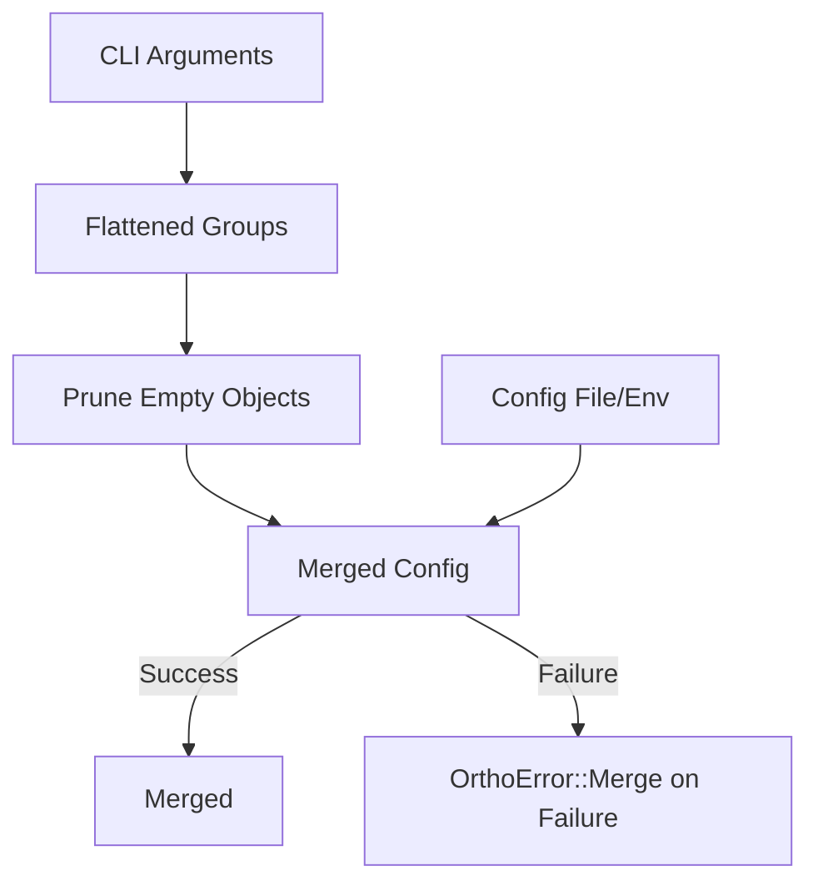
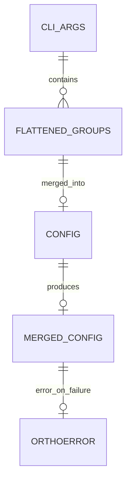

# Design Document: The `OrthoConfig` Crate

## 1. Motivation & Vision

**1.1. The Problem:** Rust application configuration is powerful but
fragmented. Developers typically hand-roll solutions by combining `clap` for
CLI, `serde` for deserialization, and `figment` or `config-rs` for layered
file/environment loading. This process involves significant boilerplate, manual
mapping of disparate naming conventions (e.g., `--kebab-case` vs.
`SNAKE_CASE`), and complex merge logic, all of which must be recreated for each
new project.

**1.2. The Vision:** `OrthoConfig` will provide a "batteries-included"
configuration solution inspired by the developer experience of tools like
`esbuild`. By using a single `derive` macro, developers will define their
configuration *once* in a plain Rust struct. The crate will then handle the
entire lifecycle of parsing, layering, merging, and deserializing from
command-line arguments, environment variables, and configuration files.

**1.3. Foreseen Benefits:**

- **For End-Users (of the application):** A consistent and predictable
  configuration experience. They can use the most convenient method (CLI, env,
  file) to configure the application, and the rules of precedence will be clear
  and unambiguous.
- **For Developers (using `OrthoConfig`):** A dramatic reduction in boilerplate
  and cognitive load. It abstracts away the tedious integration details,
  allowing developers to focus on their application's logic rather than
  configuration plumbing. This will lead to faster development, fewer bugs, and
  improved maintainability.

## 2. Core Principles & Goals

The implementation must adhere to the following principles:

- **Convention over Configuration:** The crate should have sensible defaults for
  everything: CLI flag names, environment variable names, file discovery paths,
  and merge strategies. The user should only need to add attributes for
  exceptional cases.
- **Ergonomic API:** The primary user-facing API will be a single procedural
  macro, `#[derive(OrthoConfig)]`. All functionality should flow from this.
- **Transparency:** While the crate abstracts complexity, it must not be a black
  box. Error messages must be rich, informative, and clearly attribute issues
  to their original source (e.g., "Error in `config.toml` at line 5: invalid
  type for `port`").
- **Performance:** The configuration process happens once at startup, so raw
  performance is secondary to correctness and developer experience. However,
  the implementation should be reasonably efficient and avoid unnecessary
  allocations or processing.

## 3. High-Level Architecture

The crate will be composed of three main parts:

1. **Procedural Macro (`ortho_config_macros`):** The `#[derive(OrthoConfig)]`
   macro. It will be responsible for parsing the user's struct definition and
   its attributes, then generating the necessary code.
2. **Core Crate (`ortho_config`):** The runtime component. It will contain the
   `OrthoConfig` trait, the core loading and merging logic, error types, and
   necessary helper functions.
3. **Dependencies:** It will be built upon the shoulders of established
   community crates: `clap`, `figment`, `serde`, and `syn`/`quote`.

The primary data flow for a user calling `AppConfig::load()` will be:

1. The call invokes the `load` method on the `OrthoConfig` trait, implemented by
   the derive macro.
2. The implementation first uses `clap` to parse command-line arguments into a
   temporary, partial `clap`-specific struct.
3. It then constructs a `figment` instance, adding providers in reverse order of
   precedence:
   - **Defaults Provider:** A struct containing default values defined in
    `#[ortho_config(default = …)]`.
   - **File Provider:** A `Toml` (or other format) provider that discovers and
     loads the configuration file.
   - **Environment Provider:** An `Env` provider configured with the correct
     prefix and key-mapping rules.

   - **CLI Provider:** The `clap`-parsed arguments are serialized into a
     `figment` provider and merged last. Fields left as `None` are removed
     before merging so that environment or file defaults remain untouched. This
     serialization step relies on `serde_json` and introduces a small overhead;
     if configuration loading becomes a hotspot, benchmark to evaluate a more
     direct approach. A helper, `sanitized_provider`, wraps sanitization and
     provider construction to avoid repeating the pattern. Empty objects are
     pruned during sanitization, ensuring that `#[clap(flatten)]` groups with
     no CLI overrides do not wipe out defaults from files or environment
     variables.

4. `figment`'s `extract()` method is called to deserialize the merged
   configuration into the user's `AppConfig` struct.
5. Array merging logic is applied post-deserialization if the "append" strategy
   is used.
6. The result, either `Ok(AppConfig)` or `Err(OrthoError)`, is returned.

### CLI and Configuration Merge Flow





## 4. Component Deep Dive

### 4.1. The `OrthoConfig` Trait

This defines the public API. It will be simple:

```rust
// in ortho_config/src/lib.rs

pub use ortho_config_macros::OrthoConfig;

pub trait OrthoConfig: Sized + serde::de::DeserializeOwned {
    /// Loads, merges, and deserializes configuration from all available
    /// sources according to predefined precedence rules.
    fn load() -> Result<Self, OrthoError>;
    
    // Potentially add other methods in the future, e.g.,
    // fn load_from(path: &Path) -> Result<Self, OrthoError>;
}
```

### 4.2. The `#[derive(OrthoConfig)]` Macro

This is the most complex component. It needs to perform the following using
`syn` and `quote`:

1. **Parse Attributes:** Define `#[ortho_config(...)]` attributes for both
   struct-level (e.g., `prefix`, `file_name`) and field-level (e.g.,
   `cli_long`, `env`, `default`, `merge_strategy`). A small helper named
   `parse_ortho_config` walks all attributes once and delegates each nested
   meta item to a callback. Both struct- and field-level parsers call this
   helper, so the iteration logic is not duplicated. The inner type extraction
   uses a generic `type_inner` function that accepts the wrapper name, with
   thin wrappers such as `option_inner` forwarding to it. The matcher focuses
   on the final path segments, so crate-relative forms like
   `crate::option::Option<T>` are recognized.
2. **Generate a `clap`-aware Struct:** In the generated code, create a hidden
   struct derived from `clap::Parser`. Its fields should correspond to the main
   struct's fields but be wrapped in `Option<T>` to capture only user-provided
   values. The macro translates `#[ortho_config(cli_long="…")]` and
   `#[ortho_config(cli_short='x')]` attributes into `#[arg(long=…, short=…)]`
   on this struct. When these attributes are absent, long names are derived
   automatically from the field name using `kebab-case` and short names default
   to the field's first character. If the short letter is already used, the
   macro tries the upper-case variant. A further collision triggers a compile
   error and requires the user to supply `cli_short`. Short flags must be ASCII
   alphanumeric and cannot reuse clap's `-h` or `-V`. Long flags must contain
   only ASCII alphanumeric characters plus `-` or `_` and may not be `help` or
   `version`.
3. **Generate `impl OrthoConfig for UserStruct`:**
   - This block contains the `load_from_iter` method used by the `load`
     convenience function.
   - The generated loader performs the architectural flow described in section
     3, parsing the CLI into the hidden struct before layering file and
     environment sources.
   - It dynamically generates the `figment` profile based on parsed attributes.
     For example, it uses the `prefix` attribute for
     `figment::providers::Env::prefixed(…)`.

### 4.3. Orthographic Name Mapping

The macro must enforce naming conventions automatically.

- **Struct Field to CLI Flag:** A field `listen_port` should automatically
  become `--listen-port` unless overridden by
  `#[ortho_config(cli_long = "…")]`. This involves converting `snake_case` to
  `kebab-case`.
- **Struct Field to Env Var:** A field `listen_port` within a struct with
  `#[ortho_config(prefix = "MY_APP")]` should become `MY_APP_LISTEN_PORT`.
  Nested structs (e.g., `database.url`) should become `MY_APP_DATABASE__URL`
  (using a configurable delimiter). This involves converting `snake_case` to
  `UPPER_SNAKE_CASE`.
- **Struct Field to File Key:** This is handled by `serde` and `figment`. By
  default, `serde` expects file keys to match Rust field names (`snake_case`).
  We can consider adding a struct-level attribute
  `#[ortho_config(rename_all = "kebab-case")]` which would pass the
  corresponding `#[serde(rename_all = "…")]` attribute to the user's struct.

### 4.4. Array (`Vec<T>`) Merging

This is a key user-experience feature.

- **`merge_strategy = "append"` (Default):** The generated `load()` function
  cannot simply use `figment::extract()` when merging arrays. It must:
  1. Create separate `figment` instances for each source layer (File, Env, CLI).
  2. Extract the `Vec<T>` field from each layer individually, ignoring errors if
     the field is absent.
  3. Concatenate the resulting `Vec`s in the correct order (File -> Env -> CLI).
  4. Create a final "override" `figment` provider containing only the merged
     `Vec`.
  5. Merge this override provider on top of the main `figment` instance before
     calling `extract()` on the final result. This ensures the combined `Vec`
     is present for deserialization.

### 4.5. Error Handling

A custom, comprehensive error enum is non-negotiable for a good user experience.

```rust
// in ortho_config/src/error.rs

use thiserror::Error;

/// Wraps multiple configuration errors and implements [`Display`].
pub struct AggregatedErrors(pub Vec<OrthoError>);

impl std::fmt::Display for AggregatedErrors {
    fn fmt(&self, f: &mut std::fmt::Formatter<'_>) -> std::fmt::Result {
        for (i, err) in self.0.iter().enumerate() {
            if i > 0 {
                writeln!(f)?;
            }
            write!(f, "{}: {err}", i + 1)?;
        }
        Ok(())
    }
}

#[derive(Debug, Error)]
pub enum OrthoError {
    #[error("Failed to parse command-line arguments: {0}")]
    CliParsing(#[from] Box<clap::Error>),

    #[error("Configuration file error in '{path}': {source}")]
    File {
        path: std::path::PathBuf,
        #[source]
        source: Box<dyn std::error::Error + Send + Sync>, // Wraps IO, TOML parsing errors
    },

    #[error("Failed to gather configuration: {0}")]
    Gathering(#[from] Box<figment::Error>),

    #[error("Failed to merge CLI with configuration: {source}")]
    Merge { #[source] source: Box<figment::Error> },

    #[error("multiple configuration errors:\n{0}")]
    Aggregate(Box<AggregatedErrors>),

    // More specific errors as needed
    #[error("Validation failed for '{key}': {message}")]
    Validation {
        key: String,
        message: String,
    },
}
```

The implementation must be careful to wrap errors from `clap`, `figment`, and
file IO into this enum, adding contextual information (like file paths) where
possible. `Gathering` covers failures while sourcing defaults from files or the
environment. When CLI values are overlaid onto those defaults, any merge or
deserialization failures map to `Merge`.

### 4.6. Configuration File Discovery

On Unix-like systems and Redox, the crate uses the `xdg` crate to locate
configuration directories. It respects `XDG_CONFIG_HOME` and falls back to
`$HOME/.config` when the variable is unset.

On Windows and other platforms, the `directories` crate provides the standard
paths for configuration files. On Windows this uses the Known Folder API and
resolves to `%APPDATA%` (a.k.a. `FOLDERID_RoamingAppData`) and `%LOCALAPPDATA%`
(`FOLDERID_LocalAppData`). The crate does not consult `XDG_CONFIG_HOME` at all.

Support for `XDG_CONFIG_HOME` on Windows could be added later using
`directories` to mimic the XDG specification.

### 4.7. Comma-Separated Environment Lists

Environment variables often provide simple comma-separated strings for lists.
The crate introduces a `CsvEnv` provider that wraps `figment::providers::Env`
and converts comma-separated values into arrays unless the value already
resembles structured data. This preserves JSON syntax while allowing variables
like `DDLINT_RULES=A,B,C` to deserialize as `["A", "B", "C"]`. Values
containing literal commas must be wrapped in quotes or brackets to avoid being
split. The derive macro now uses `CsvEnv` instead of `Env` so list handling is
consistent across files, environment, and CLI inputs.

### 4.8. Configuration Inheritance

Some projects require a base configuration that can be extended by other files.
A configuration file may specify an `extends` key whose value is a relative or
absolute path to another file. When present, the loader first loads the
referenced file and then merges the current file over it. The path is resolved
relative to the file containing the `extends` key. The loader detects cycles
and reports a `CyclicExtends` error listing the chain of files.

Precedence across all sources becomes:

1. Base file specified via `extends`
2. The extending file itself
3. Environment variables
4. Command‑line arguments

Prefixes and subcommand namespaces are applied at each layer just as they would
be without inheritance.

### 4.9. Improved Subcommand Merging

Earlier versions extracted subcommand defaults before applying CLI overrides.
Missing required fields in `[cmds.<name>]` caused deserialization failures even
when the CLI supplied those values. The revised implementation builds the
`Figment` from file and environment sources first, then merges the already
parsed CLI struct before extraction. This ensures that required CLI arguments
fulfil missing defaults and eliminates workarounds like
`load_with_reference_fallback`. The legacy `load_subcommand_config` helpers
were removed in v0.5.0.

A helper trait, SubcmdConfigMerge, provides a default load_and_merge method for
subcommand structs. It borrows self to avoid unnecessary cloning and removes
the need for repetitive implementation blocks across subcommands.

Import it with:

```rust
use ortho_config::SubcmdConfigMerge;
```

The sequence below shows how subcommand defaults are gathered and how gathering
errors propagate to the caller.

```mermaid
sequenceDiagram
  autonumber
  actor CLI as CLI
  participant SC as Subcommand Loader
  participant Fig as figment::Figment
  participant Err as OrthoError

  CLI->>SC: load_subcommand_config<T>()
  SC->>Fig: extract::<T>()
  alt Success
    Fig-->>SC: T
    SC-->>CLI: T
  else Gathering error
    Fig-->>SC: figment::Error
    SC->>Err: OrthoError::gathering(figment::Error)
    Err-->>SC: OrthoError::Gathering
    SC-->>CLI: Err(OrthoError::Gathering)
  end

### 4.10. Dynamic rule tables

Configuration structures may include map fields such as
`BTreeMap<String, RuleCfg>` to support dynamic tables where the keys are not
known at compile time. The loader deserializes any sub-table beneath the map
key and preserves unknown rule names. This allows applications to accept
arbitrary rule configurations like `[rules.consistent-casing]` without
additional code. Entries may originate from files, environment variables or CLI
flags and follow the usual precedence rules.

### 4.11. Ignore pattern lists

Vector fields such as `ignore_patterns` can be populated from comma-separated
environment variables and CLI flags. Values are merged using the `append` merge
strategy so that patterns from configuration files are extended by environment
variables and finally CLI arguments. Whitespace is trimmed and duplicates are
preserved.

### 4.12. Renaming the configuration path flag

The derive macro exposes the generated `config_path` field, allowing projects
to rename the hidden `--config-path` flag by defining their own field with a
`cli_long` attribute. The associated environment variable remains `CONFIG_PATH`.

## 5. Dependency Strategy

- **`ortho_config_macros`:**
  - `syn`: To parse Rust code and attributes.
  - `quote`: To generate Rust code.
  - `proc-macro2`: For improved procedural macro APIs.
- **`ortho_config` (Core):**
  - `clap`: For CLI parsing. Choose a version with the `derive` feature.
  - `figment`: As the core layering engine.
  - `serde`: For serialization/deserialization.
  - `serde_json`: For manipulating configuration when pruning `None` CLI
    values.
  - `toml`, `figment-json5`, `json5`, `serde_yaml`: As optional feature-gated
    dependencies for different file formats. `toml` should be a default
    feature. The `json5` feature uses `figment-json5` and `json5` to parse
    `.json` and `.json5` files and relies on `serde_json` for validation.
    Loading these formats without enabling `json5` should produce an error, so
    users aren't surprised by silent TOML parsing.
  - `thiserror`: For ergonomic error type definitions.

  The core crate re-exports `figment`, `uncased`, `xdg`, and the optional
  format parsers, so downstream libraries can import them via `ortho_config::`
  without declaring separate dependencies.

## 6. Implementation Roadmap

1. **V0.1 (Scaffolding):**

   - Set up the workspace with the two crates.
   - Define the `OrthoConfig` trait and `OrthoError` enum.
   - Create a basic derive macro that implements `OrthoConfig` with an empty
     `load` method.

2. **V0.2 (Core Layering):**

   - Implement the `load` method using `figment` to layer hardcoded TOML file
     and environment sources.
   - Implement `snake_case` to `UPPER_SNAKE_CASE` mapping for the `Env`
     provider.
   - Ensure basic deserialization works.

3. **V0.3 (`clap` Integration):**

   - Add `clap` as a dependency.
   - Update the derive macro to generate the hidden `clap`-aware struct.
   - Integrate the parsed CLI arguments as the highest-precedence `figment`
     layer.
   - Implement `snake_case` to `kebab-case` mapping for CLI flag generation.

4. **V0.4 (Attribute Handling):**

   - Flesh out the attribute parsing logic in the macro for `prefix`, `default`,
     `cli_long`, etc.
   - Make the generated code respect these attributes.

5. **V0.5 (Advanced Features & Polish):**

   - Implement the `merge_strategy = "append"` logic for `Vec<T>`.
   - Refine error messages to be maximally helpful.
   - Add extensive documentation and examples.
   - Feature-gate the file format support (`json5`, `yaml`).

## 7. Future Work

- **Async Support:** A version of `load` that uses non-blocking IO.
- **Custom Sources:** An API for users to add their own `figment` providers
  (e.g., from a database or a remote service like Vault).
- **Live Reloading:** A mechanism to watch configuration files for changes and
  reload the configuration at runtime.

This design provides a clear path forward for implementing `OrthoConfig`. By
building on a solid foundation of existing crates and focusing on the developer
experience, we can create a highly valuable addition to the Rust ecosystem.
