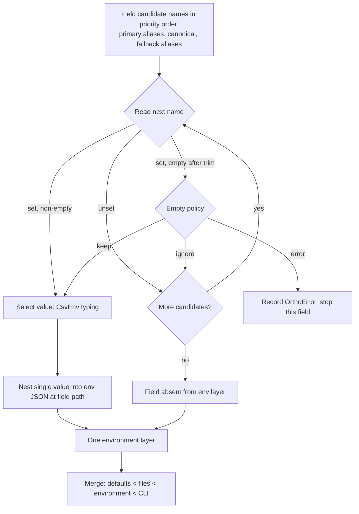

# RFC 0001: Field-level environment aliases

## Preamble

- **RFC number:** 0001
- **Status:** Proposed
- **Created:** 2026-06-18

## 1. Summary

This RFC proposes that `ortho_config` grow **first-class, field-level
environment projections**: a declarative way to bind a configuration field to
one or more environment-variable names, with deterministic intra-environment
precedence, empty-value handling, and secret-redaction metadata.

The motivating need is unprefixed, externally-owned environment variables. A
field such as `github_token` on a `#[ortho_config(prefix = "VK")]` struct
should be populated from the application's canonical `VK_GITHUB_TOKEN` and
*also* from the well-known external `GITHUB_TOKEN`, with the canonical name
winning when both are set. Today consumers express this by reaching outside the
crate's layer machinery and re-implementing precedence by hand. This RFC moves
that capability into the library so that consumers describe the binding once
and read the resolved field directly.

The design is deliberately narrow. It does **not** add a global "also read raw
environment variables" mode. Every external name a field accepts is declared
explicitly, so the crate never scans the whole process environment. The change
is additive at runtime: a struct that uses no new attribute behaves exactly as
it does today.

Two consumers drive the design and are used as worked examples throughout: `vk`
(a single GitHub-token fallback) and `podbot` (a hand-written
environment-to-config-path table). `podbot` also has a distinct "list of
environment-variable names" concern; this RFC analyses it but defers the
concrete primitive to a planned companion, RFC 0002 (see §4 and §5.7).

This document has already been through an internal multi-perspective design
review; §13 records the findings folded into this revision.

## 2. Problem

Applications built on `ortho_config` repeatedly need to source configuration
from environment variables that do **not** carry the application's prefix.
These are typically well-known names owned by an external tool or platform —
`GITHUB_TOKEN`, `ANTHROPIC_API_KEY`, and similar. The crate's environment layer
is prefix-scoped, so today these names can only be honoured by writing bespoke
resolution code that sits outside the normal layering, merging, provenance, and
documentation machinery.

This produces three recurring problems.

1. **Duplicated precedence logic.** Each consumer re-implements "command-line
   argument beats canonical environment variable beats external environment
   variable beats configuration file", a ranking the crate already understands
   for every other field. The hand-rolled version can drift from the crate's
   semantics (for example, in how it treats an empty string).
2. **Invisible bindings.** Because the external name is resolved outside the
   crate, it does not appear in generated help, the documentation intermediate
   representation (IR), agent-context output, or provenance. Operators and
   agents cannot discover that `GITHUB_TOKEN` is honoured.
3. **No shared safety rails.** Secret values resolved by bespoke code are not
   marked as secret, so the crate's redaction surfaces cannot protect them, and
   there is no shared validation for the "list of environment-variable names"
   pattern (see §5.7).

The naive fix — letting the environment layer read the whole process
environment when no prefix is set — is a footgun with a velvet trigger.
Unrelated variables could collide with field names, ambient secrets could
wander into config-shaped space, and applications would lose the useful
distinction between *application-owned* variables and *well-known external*
variables. Every configuration ecosystem that offers whole-environment scanning
documents this hazard (see §10). The better primitive is an explicit, per-field
allow-list of accepted names.

## 3. Current state

### 3.1 How environment loading works today

The environment becomes **exactly one merge layer**. The generated
`compose_layers` implementation builds an environment provider, extracts it to
a single `serde_json::Value`, and pushes it once via
`composer.push_environment(value)`
(`ortho_config_macros/src/derive/load_impl.rs`). The provider itself is
`CsvEnv::prefixed(prefix)` (or `CsvEnv::raw()` when no prefix is configured),
followed by a uniform key-mapping closure that upper-cases each key and splits
it on `__` to reconstruct a nesting path
(`ortho_config_macros/src/derive/build/env.rs` and `load_impl.rs`). The
upper-casing step is part of today's observable behaviour, not an incidental
detail.

`CsvEnv` wraps `figment`'s `Env` provider and performs value typing in
`parse_value`/`parse_scalar`/`should_parse_as_csv`
(`ortho_config/src/csv_env.rs`): it trims the raw value, a comma-separated
string becomes an array, the literals `true`/`false` become booleans
(case-insensitively), other scalars are parsed through `serde_json`, and
everything else stays a string. A value that is **set but empty** is currently
kept as the empty string.

For a field `github_token` on a struct with `#[ortho_config(prefix = "VK")]`,
`figment` strips the `VK_` prefix, the closure upper-cases the remainder, and
the field resolves from `VK_GITHUB_TOKEN`. Nested fields use the `__`
delimiter, so `database.url` resolves from `VK_DATABASE__URL`. This mapping is
the crate's established orthographic naming rule (`docs/design.md` §4.5).

The orthodox precedence across all sources is:

```plaintext
defaults < config files < environment < CLI
```

The documentation IR already models this: `PrecedenceMeta` carries an ordered
list of `SourceKind` values (`Defaults`, `File`, `Env`, `Cli`) in
`ortho_config/src/docs/ir.rs`. Roadmap §9.1.2 plans to insert a *selected
profile* layer between files and the environment; §5.1 notes how this RFC stays
compatible with that.

### 3.2 Field-level attributes and the error model today

The derive macro recognises the field-level keys `cli_long`, `cli_short`,
`default`, `merge_strategy`, `skip_cli`, and `cli_default_as_absent`, plus
documentation attributes (`ortho_config_macros/src/derive/parse/mod.rs`). There
is **no** `env(...)` grammar. Unknown attribute keys are silently discarded for
forwards compatibility.

Errors accumulate rather than abort: the generated loader holds an
`errors: Vec<Arc<OrthoError>>`, pushes one per fallible step, and hands the lot
to `LayerComposition::new(layers, errors)`. `OrthoError` already has an
`Aggregate(Box<AggregatedErrors>)` variant and `try_aggregate`/`aggregate`
constructors (`ortho_config/src/error/`), so multiple errors compose without a
new error type. A deserialization failure is built through
`<figment::Error as serde::de::Error>::custom(&e)`, which — per the comment in
`ortho_config/src/result_ext.rs` — "preserves the full error message". For a
type mismatch, `serde_json`'s message embeds the offending value verbatim. This
fact is load-bearing for the secret model in §5.5.

The documentation IR exposes per-field environment metadata as `EnvMetadata`,
which currently holds a single field, `var_name: String`
(`ortho_config/src/docs/ir.rs`), and is emitted under a versioned `ir_version`
string (currently `"1.1"`). The man-page renderer prints that name in the
ENVIRONMENT section; the agent-context bridge does not yet surface environment
metadata at all.

### 3.3 What the consumers do

`vk` has a `GlobalArgs` struct (`#[ortho_config(prefix = "VK")]`) with a
`github_token` field, but token resolution happens in a separate helper that
manually ranks command-line input, `VK_GITHUB_TOKEN`, `GITHUB_TOKEN`, and then
the configuration-file value. The helper is semantically correct but lives
outside the crate's layer machinery, so documentation, provenance, generated
behaviour, and tests must all remember the side-tunnel.

`podbot` maintains a hand-written table mapping concrete names such as
`PODBOT_GITHUB_APP_ID` onto JSON paths such as `["github", "app_id"]`, with
explicit per-type handling for strings, string lists, booleans, and `u64`s. Its
loader inserts that environment JSON between file configuration and host
overrides. This is, in effect, an application-local re-implementation of
"environment-variable projection into configuration paths" — precisely the
crate's territory.

`podbot` also has a distinct concern that is **not** aliasing: an
`agent.env_allowlist: Vec<String>` field whose value is a list of
environment-variable *names* (for example,
`["OPENAI_API_KEY", "ANTHROPIC_API_KEY"]`) to be copied from the host into a
child agent runtime. The list itself loads as ordinary configuration; the act
of forwarding those host variables is a security decision. §5.7 separates these
two concepts cleanly and explains why the second is deferred to RFC 0002.

## 4. Goals and non-goals

- Goals:
  - Let a field declare additional, explicit environment-variable names —
    including unprefixed external names — that feed it, with deterministic
    intra-environment precedence (canonical name shadows aliases by default).
  - Preserve the orthodox layer precedence (`defaults < files < environment <
    CLI`) and the existing single-environment-layer merge model unchanged.
  - Provide empty-value handling so that an empty canonical variable can fall
    through to an alias or a lower layer.
  - Carry secret metadata so resolved values can be redacted consistently across
    diagnostics, generated help, the documentation IR, and agent-context output.
  - Surface canonical names and *all* aliases — including higher-priority ones —
    in generated documentation and provenance, marking each alias's priority and
    whether it is prefixed, and marking secrets as redacted.
  - Let `vk` delete its bespoke token resolver and let `podbot` delete most of
    its hand-written projection table.
- Non-goals:
  - Reading the entire process environment, implicitly or via a global switch.
  - Changing the cross-layer precedence order or the number of environment
    layers.
  - Encrypting, zeroizing, or fetching secret values from a secrets manager.
    That is the territory of roadmap §10.2.2 (custom providers); this RFC only
    *marks* values as secret so the redaction surfaces can act.
  - Per-field custom value parsers. `CsvEnv` already infers CSV lists, booleans,
    and scalars uniformly; a per-field parser is deferred to future work.
  - The "list of environment-variable names as configuration values" primitive
    (`podbot`'s `env_allowlist`). The conceptual separation is settled here
    (§5.7), but the concrete `env_value_names`/`EnvPassthrough` design is
    deferred to a planned companion, RFC 0002, because it shares no mechanism
    with aliasing beyond the secret vocabulary.
  - Committing a public, hand-driven environment-resolution builder. The runtime
    glue this RFC introduces is internal (`#[doc(hidden)]`); see §5.3.

## 5. Proposed design

### 5.1 Overview and the precedence model

A field gains an optional `env(...)` attribute that declares how it draws from
the environment. The cross-layer order is unchanged and is stated once here:

```plaintext
defaults < config files < environment < CLI
```

Roadmap §9.1.2 will later insert a *selected profile* layer between files and
the environment. This RFC's single-environment-layer model is unaffected by
that insertion; only the prose ordering gains a neighbour. To avoid stale
doc-comments, the canonical statement of cross-layer order lives in
`PrecedenceMeta` and this section, not scattered through generated help.

Within the single environment layer, names are resolved by **first match wins**
in a fixed priority order. The canonical (prefixed) name is the pivot: aliases
declared as `primary` are tried before it, aliases declared as `fallback` are
tried after it. The default for an alias is `fallback`, so the common case
preserves "canonical shadows alias":

```plaintext
VK_GITHUB_TOKEN > GITHUB_TOKEN
```

This mirrors the GitHub command-line tool's documented convention that the
tool-specific name outranks the generic shared name[^ghcli], inverted to the
crate's own namespace: the application-owned `VK_GITHUB_TOKEN` shadows the
external `GITHUB_TOKEN`.

The single most important architectural rule is this: **alias resolution is
selection, never concatenation.** At most one source contributes a value per
field, chosen by priority before the value enters the one environment layer.
This is what keeps the feature compatible with collection merge strategies (see
§5.4).

The following description, for screen readers, accompanies the resolution
diagram below. The flow begins with a field's ordered list of candidate
environment-variable names: primary aliases first, then the canonical name,
then fallback aliases. Each candidate is read from the environment in turn. A
name that is unset is skipped. A name that is set but empty (after trimming) is
handled according to the field's empty policy — kept as a value, ignored so the
next candidate is tried, or recorded as an error that stops only that field.
The first present-and-accepted value is nested into a single environment JSON
object at the field's path; later candidates for that field are not consulted.
That single object becomes the one environment merge layer, which is then
merged with the defaults, file, and command-line layers in the orthodox order.



*Figure 1: Per-field environment resolution feeding the single environment
layer.*

### 5.2 Macro attribute grammar

A field may carry one or more `#[ortho_config(env(...))]` attributes. The
sub-grammar is the smallest surface sufficient for the use cases.

| Key        | Form                    | Value  | Repeatable | Scope | Default    | Meaning                                                                                         |
| ---------- | ----------------------- | ------ | ---------- | ----- | ---------- | ----------------------------------------------------------------------------------------------- |
| `alias`    | `alias = "NAME"`        | string | yes        | group | none       | Additional accepted name. Ordered by the group's `priority`.                                    |
| `name`     | `name = "NAME"`         | string | no         | field | derived    | Replaces the canonical derived name.                                                            |
| `prefixed` | `prefixed = false`      | bool   | no         | group | `true`     | Whether the struct prefix is applied to the `name`/`alias` in the same group.                   |
| `empty`    | `empty = "ignore"`      | enum   | no         | field | `keep`     | Treatment of a set-but-empty value: `keep`, `ignore`, or `error`.                               |
| `secret`   | `secret`                | flag   | no         | field | `false`    | Marks the value sensitive for redaction.                                                        |
| `priority` | `priority = "fallback"` | enum   | no         | group | `fallback` | Orders the alias(es) in the same group relative to the canonical name: `primary` or `fallback`. |
| `skip`     | `skip`                  | flag   | no         | field | `false`    | Excludes the field from environment loading entirely.                                           |

*Table 1: The `env(...)` field-attribute sub-grammar. "Scope" states whether a
key binds to the whole field or only to the `env(...)` group it appears in.*

**Group versus field scope.** A single `env(...)` attribute is a *group*. All
`alias`/`name` entries in one group share that group's single `priority` and
`prefixed` setting; to give two aliases different priorities, place them in
separate groups, as the multi-alias example below does. `empty`, `secret`, and
`skip` are *field-scoped*: they describe the field as a whole regardless of
which group they appear in, and they may appear in at most one group (Table 2
makes a second, conflicting occurrence an error).

Worked forms:

```rust,ignore
// vk: accept the external GITHUB_TOKEN below the canonical VK_GITHUB_TOKEN,
// ignore an empty value so it falls through, and redact the resolved token.
#[ortho_config(env(alias = "GITHUB_TOKEN", empty = "ignore", secret))]
pub github_token: Secret<String>,

// Exact replacement of the canonical name, bypassing the prefix entirely.
#[ortho_config(env(name = "GITHUB_TOKEN", prefixed = false))]
pub github_token: Option<String>,

// Disable environment loading for a computed field.
#[ortho_config(env(skip))]
pub computed_value: String,

// Multiple aliases with explicit ordering, one per group. Resolution order for
// the field is: primary aliases (author order), canonical, fallback aliases.
#[ortho_config(env(alias = "GITHUB_TOKEN", priority = "primary"))]
#[ortho_config(env(alias = "GH_TOKEN", priority = "fallback"))]
pub github_token: Secret<String>,
```

The accepted tokens are closed sets, validated with a spanned error that lists
the alternatives, mirroring the existing `merge_strategy` parser. `empty`
accepts `keep`, `ignore`, or `error`. `priority` accepts `primary` or
`fallback`.

The default empty policy is `keep`. This is mandatory for backwards
compatibility: today an empty environment variable already yields an
empty-string value, and the default must preserve that. Emptiness is evaluated
on the *trimmed* string, consistent with `CsvEnv`, which also trims before
typing. One consequence is worth stating: a value such as `","` is **not**
empty after trimming, so it is selected and parsed by `CsvEnv` into a
two-element array of empty strings (`["", ""]`); the empty policy does not
fire. §8.4 pins this edge.

The default alias priority is `fallback`. Demoting the canonical name is the
rarer, louder intent, so the canonical name wins unless an alias is explicitly
declared `primary`. This makes the bare `env(alias = "GITHUB_TOKEN")` a pure
back-fill that matches the `VK_GITHUB_TOKEN > GITHUB_TOKEN` requirement.

The two-band priority (`primary`/`fallback`) is the *grammar* surface; the
*representation* is a total order — `(band, author position)` — so an ordered
list of three or more candidates is already expressible by placing each in its
own group. An integer rank is deliberately not exposed in the grammar now, but
because the internal representation is already a total order, promoting it
later is additive (see §11).

The parser populates a `FieldEnvAttrs` value added to the existing `FieldAttrs`:

```rust,ignore
#[derive(Default, Clone)]
pub(crate) struct FieldEnvAttrs {
    pub skip: bool,
    pub name: Option<EnvNameSpec>,    // value + span + prefixed flag
    pub aliases: Vec<EnvAliasSpec>,   // value + span + priority + prefixed flag
    pub empty: Option<EmptyPolicy>,   // None inherits the Keep default
    pub secret: bool,
}

#[derive(Clone, Copy, PartialEq, Eq)]
pub(crate) enum EmptyPolicy { Keep, Ignore, Error }

#[derive(Clone, Copy, PartialEq, Eq)]
pub(crate) enum EnvPriority { Primary, Fallback }
```

`EnvNameSpec`/`EnvAliasSpec` retain the literal's `Span` so that
prefix-dependent validation, which can only run once the struct prefix is
known, can still report an error pointed at the offending literal. The build
phase receives these spans (see §5.3) rather than re-deriving them.

Parsing follows the existing `parse_nested_meta` pattern used for the
`discovery(...)` attribute: each `env(...)` group is collected into a small
accumulator and then resolved, distributing the group's `priority`/`prefixed`
over the names in that group.

Validation is stricter than the crate's usual "discard unknown keys" leniency,
because this is a security-sensitive surface and the macro has no warning
channel — the only outcomes are *error* and *silently allow*. The crate's
forwards-compatibility leniency is retained for genuinely unknown *outer*
attribute keys, but contradictory or malformed uses of *known* `env` keys are
hard errors, spanned at the offending literal.

| Combination                                                   | Decision | Rationale                                                                 |
| ------------------------------------------------------------- | -------- | ------------------------------------------------------------------------- |
| Unknown key inside `env(...)` (for example `env(allias = …)`) | Error    | A misspelt `secret`/`name` that silently fails is a security footgun.     |
| `skip` with any other `env` key on the field                  | Error    | "Do not read env" plus "read env from X" is contradictory.                |
| `name` together with `alias`                                  | Allow    | Rename the canonical source and still accept legacy aliases.              |
| Duplicate `name`                                              | Error    | Ambiguous; mirrors the existing duplicate-`crate` guard.                  |
| Conflicting `empty` across groups (`keep` then `error`)       | Error    | `empty` is field-scoped; two different values are contradictory.          |
| Repeated `secret` across groups with no conflict              | Allow    | Idempotent; `secret` is a field-scoped flag.                              |
| `prefixed` in a group with no `name`/`alias`                  | Error    | Nothing for it to govern.                                                 |
| `priority` in a group with no `alias`                         | Error    | Meaningless on the canonical name alone.                                  |
| Two `priority` keys in one group                              | Error    | A group has one priority by definition.                                   |
| `alias`/`name` equal to the canonical name                    | Error    | A self-alias is always a mistake and would duplicate a projection key.    |
| Two aliases with the same string (case-insensitively)         | Error    | Redundant; duplicate projection key.                                      |
| `alias`/`name` on a struct with no prefix                     | Allow    | With no prefix, `prefixed = true`/`false` collapse to the same raw match. |

*Table 2: Compile-time validation rules for the `env(...)` grammar.*

The canonical name derivation is unchanged. `env(name = "X")` replaces the
derived leaf; `prefixed = false` matches the literal name against the
unprefixed environment, bypassing the prefix entirely (this is the escape hatch
for vendor-fixed names such as `GITHUB_TOKEN`). For nested fields the alias
overrides only the leaf source key; the value still nests at the field's path.

### 5.3 Runtime glue and the resolution algorithm

The runtime types introduced here are **internal generated glue, not committed
public API**. They are marked `#[doc(hidden)]` and may change without a major
version bump; the only thing a downstream crate does with them is have the
derive macro emit a `const` table. The sole stable public surface added by this
RFC is the extended `EnvMetadata` (§5.6), which is already public, and the
`Secret<T>` wrapper (§5.5). This keeps the forever-contract exposure minimal
until a second caller justifies a public, hand-driven builder.

The derive macro generates a `const` projection table from field metadata. Each
entry is an `EnvProjection`:

```rust,ignore
#[doc(hidden)]
#[derive(Clone, Copy, Debug)]
pub struct EnvProjection {
    /// Canonical, prefix-qualified source variable, e.g. "VK_GITHUB_TOKEN".
    pub canonical: &'static str,
    /// Destination path in the resolved JSON, pre-split and serde-cased,
    /// e.g. &["github", "token"].
    pub path: &'static [&'static str],
    /// Additional source names, each tagged with priority. Resolution
    /// re-orders by priority; author order breaks ties within a band.
    pub aliases: &'static [EnvAlias],
    /// Treatment of a present-but-empty value at the selected source.
    pub empty: EmptyPolicy,
    /// Marks the resolved value sensitive for redaction surfaces.
    pub secret: bool,
}

#[doc(hidden)]
#[derive(Clone, Copy, Debug)]
pub struct EnvAlias {
    pub env_var: &'static str,
    pub priority: EnvPriority,
}
```

Every value in a projection is known at derive time, so the table is
`const`-constructible and allocation-free. Crucially, these types are **not**
`#[non_exhaustive]`: that attribute forbids struct-literal construction outside
the defining crate, which is exactly what the macro output in a downstream
crate must do. Forwards compatibility is bought instead by keeping the types
`#[doc(hidden)]` and internal — adding a field is then a coordinated change
between the macro and the runtime in the same workspace, not a public break.

A per-field `parser` field is **omitted in this version**.
`CsvEnv::parse_value` already infers CSV lists, booleans, and scalars, and the
destination type is enforced by `serde` when the merged layer is deserialized.
A per-field parser would create a second place where "what does `true` mean"
can drift. It can be added later as an additive internal field if a real need
(for example forced JSON or base64 secrets) appears.

The generated loader hands the table and an environment source to an internal
resolver. An illustrative builder shape documents the intended internal API; it
is not public:

```rust,ignore
// Internal; the macro emits the equivalent of this, then drains the errors.
let (env_value, env_errors) = ortho_config::env::resolve(
    &__ORTHO_ENV_PROJECTIONS,   // &'static [EnvProjection]
    EnvSource::Process,         // injectable; an in-memory map in unit tests
);
```

`resolve` returns `(serde_json::Value, Vec<Arc<OrthoError>>)` — the resolved
environment object **plus** the errors gathered while resolving it. This shape
is chosen deliberately over `Result<Value, _>`: a single field hitting
`empty = "error"` records its error but does **not** discard the other fields'
environment values. The generated code appends the errors to the established
collection and pushes the value exactly once, mirroring today's pattern and
keeping per-error provenance flat (no nested aggregates):

```rust,ignore
let (env_value, mut env_errors) = ortho_config::env::resolve(table, source);
errors.append(&mut env_errors);
composer.push_environment(env_value);   // STILL one layer
```

The resolution algorithm, for each projection:

```text
candidates = [primary aliases in author order]
           ++ [canonical]
           ++ [fallback aliases in author order]

for name in candidates:
    raw = source.get(name)        # reads ONLY this declared name
    if raw is None: continue      # unset: try next candidate
    if raw.trim() is empty:       # trimmed, to match CsvEnv
        match empty_policy:
            Ignore: continue                       # treat as unset
            Error:  record Validation(name); stop  # do NOT fall through
            Keep:   value = CsvEnv::parse_value(raw); stop
    else:
        value = CsvEnv::parse_value(raw); stop

if a value was selected:
    deep-merge it into the result object at `path`  # leaf replace; see §5.4
```

Because there is one value per path, no ambiguity arises within the environment
layer. An `Error` empty policy deliberately does not fall through, because a
present-but-empty value at the highest-priority *present* source is a definite
user mistake, and continuing would mask it. The recorded error names the
*variable*, never the value.

Reading the environment is safe by construction. For declared projections,
`resolve` reads only the *named* candidate variables. A process with thousands
of unrelated secrets in its environment never has them enumerated, copied, or
logged. The `EnvSource` is injectable (process environment by default, an
in-memory map for unit tests). Note that this seam covers the resolver's own
unit tests; the generated loader's compatibility substrate (§5.4) still reads
the real process environment through `figment`, so the negative test in §8.2
mutates the real environment under a shared serial guard.

`resolve` reuses `CsvEnv` rather than re-implementing it: value typing calls
`CsvEnv::parse_value` (whose visibility widens to `pub(crate)` or a thin public
wrapper) so CSV, boolean, and scalar behaviour is identical to every other
source. Only the *selection* orchestration is new.

### 5.4 Merge semantics: one environment layer, select not concatenate

The environment remains a single merge layer. This matters most for collection
fields. Collection merge strategies (`append`, `replace`, `keyed`) operate
*across* layers — defaults, each file in an `extends` chain, the environment,
and the command line are distinct layers. There is exactly one environment
layer.

The mechanism that makes "select not concatenate" hold is concrete and worth
naming. Append accumulation drains each layer's top-level field key exactly once
(`generate/declarative/collection_tokens.rs`). The environment is one
`serde_json::Value`, and a JSON object cannot hold the same key twice, so
however a field's value arrives in that object — substrate scan, projection, or
a collision of the two — the append accumulator sees the field once and extends
once. If an alias were instead implemented as an extra provider or an extra
`push_environment` call, a `Vec<T>` field present under both its canonical and
alias names would be appended twice (`A,B` plus `A,B` yielding
`[A, B, A, B]`) — silent data corruption. The design forbids this structurally
by composing everything into one object and calling `push_environment` exactly
once. The rule, stated once: **aliases select, they never concatenate.**

To preserve byte-for-byte behaviour for fields *without* an `env(...)`
attribute — including nested, flattened, and map-typed fields whose keys are
arbitrary — the generated code keeps the existing prefix-scoped scan as a
*substrate*, and merges projection values on top of it. The substrate is the
**exact** current provider chain, including the upper-casing key map:
`CsvEnv::prefixed(prefix).map(uppercase).split("__")`. A future
"simplification" to `CsvEnv::raw()` would break prefix-scoping and is
explicitly forbidden.

Combining the substrate and the projections is a **recursive object merge with
leaf replacement**, using the crate's existing `merge_value` semantics
(`declarative/merge.rs`), *not* a blind whole-subtree overwrite. For a nested
or map-typed field this preserves sibling keys: if the substrate produced
`{database: {url, pool}}` and a projection selects a value for `database.url`,
the result is `{database: {url': pool}}` — `url` is replaced, `pool` survives.
For a scalar or `Vec<T>` leaf, the leaf is replaced wholesale. Fields whose
keys are not known at derive time (arbitrary map keys, flattened structs) are
served entirely by the substrate; their alias-free projections, if any, are a
no-op overlay. The single uniform code path avoids a behavioural cliff where
adding one alias silently switches a struct between two loaders, and
`composer.push_environment` is still called exactly once.

`resolve` therefore composes in two phases: first the substrate `Value`, then
each projection's selected value deep-merged onto it. A regression test asserts
that a struct with no `env(...)` attributes — exercising nested, flattened,
`BTreeMap`-typed, and mixed-case fields — produces a byte-identical composed
environment `Value` before and after this change (§8.4).

### 5.5 Secret and redaction model

Secret handling needs two complementary mechanisms, because a secret can escape
in two different ways: through the crate's *structured* surfaces (which render
from the typed value or the IR), and through *free-form strings* into which a
value is copied (most dangerously, deserialization-error messages).

**Mechanism one — a masking newtype, `Secret<T>`.** The crate ships a wrapper:

```rust,ignore
pub struct Secret<T>(T);

impl<T> fmt::Debug   for Secret<T> { /* writes "Secret([REDACTED])" */ }
impl<T> fmt::Display for Secret<T> { /* same */ }
// Serialize/Deserialize delegate to the inner T so loading and merging are
// transparent; only Debug/Display redact.
```

A secret field should be typed `Secret<String>` (or `Secret<T>`). This is the
**only** mechanism that survives the value being copied into an arbitrary
downstream string: `serde_json`'s type-mismatch error embeds the value
verbatim, and `result_ext.rs` preserves "the full error message", so a bare
`String` secret that fails to deserialize would leak through `OrthoError`'s
`Display` and `Debug`. A `Secret<T>` value redacts at the point of formatting,
wherever that happens, including third-party logging of the loaded struct.

**Mechanism two — a layer-level secret-path set.** The IR, generated help, and
agent-context output render from *names and metadata*, not from a `Secret<T>`
value, so they need a separate signal. `resolve` records the set of secret
paths (known at derive time) in the environment layer's metadata — the *paths*,
not the values. Every structured rendering surface consults the set and omits
or redacts the value at those paths. The agent-context `env` block carries no
value slot at all, so it cannot leak a value regardless.

**Honest scope of the guarantee.** Together these cover: the loaded struct's
`Debug`/`Display` (via `Secret<T>`), deserialization-error strings (via
`Secret<T>`), and the crate's structured IR/help/agent-context surfaces (via
the path set). The residual risk is a *secret field that is not typed
`Secret<T>`* and whose value is copied into a free-form string by code the
crate does not control; for that case the `secret` flag alone cannot help,
which is precisely why the design recommends `Secret<T>` for secret fields and
why §6.3 scopes its claim accordingly. A future enhancement could have the
macro warn when a `secret` field is not a `Secret<T>`, but the macro has no
warning channel today (see §11).

This RFC introduces the per-layer secret-path set as a small, self-contained
primitive. Roadmap §9.1.2 (profile redaction) and §10.2.2 (custom-provider
secrets) **may** reuse it, but neither is yet designed, so this RFC does not
treat that reuse as a committed contract — it is an opportunity, not a
requirement on this work.

### 5.6 Documentation and provenance surface

`EnvMetadata` is extended from its current single `var_name` field to carry the
canonical name, ordered aliases (each with its priority and prefixed flag), the
secret flag, the empty policy, and the prefixed flag for the canonical name.
The extension renames `var_name` to `canonical` and therefore bumps the IR
version from `1.1` to `1.2`; the rename is read-compatible via a serde alias so
existing IR documents still parse:

```rust,ignore
#[derive(Debug, Clone, Serialize, Deserialize, PartialEq, Eq)]
pub struct EnvMetadata {
    /// Canonical, prefix-derived name; highest priority within the env layer.
    /// `#[serde(alias = "var_name")]` is read-only: a legacy document with
    /// `var_name` parses, but the producer always writes `canonical`.
    #[serde(alias = "var_name")]
    pub canonical: String,
    #[serde(default, skip_serializing_if = "Vec::is_empty")]
    pub aliases: Vec<EnvAliasDoc>,
    #[serde(default, skip_serializing_if = "is_false")]
    pub secret: bool,
    #[serde(default)]
    pub empty: EmptyPolicy,        // same enum/wire form as the runtime
    #[serde(default = "default_true", skip_serializing_if = "is_true")]
    pub prefixed: bool,
}

/// Documentation view of one alias. Distinct from the runtime `EnvAlias`
/// (which is internal glue): this is the stable, serialised contract.
#[derive(Debug, Clone, Serialize, Deserialize, PartialEq, Eq)]
pub struct EnvAliasDoc {
    pub name: String,
    /// Faithful to the resolution model, so a `primary` alias is representable.
    pub priority: EnvPriority,     // "primary" | "fallback"
    #[serde(default = "default_true", skip_serializing_if = "is_true")]
    pub prefixed: bool,
}
```

Three review-driven corrections are baked in here. First, the deprecated
output-mirror of `var_name` is **dropped**: a read-only `#[serde(alias)]`
already buys backward compatibility on read, and re-emitting `var_name` would
break the `PartialEq`/`Eq` snapshot round-trip the IR relies on and create an
ambiguous two-key input. The rename is signalled honestly by the `ir_version`
bump that already exists for exactly this purpose. Second, the IR alias is its
**own** type, `EnvAliasDoc`, distinct from the internal runtime `EnvAlias`, so
the two never share a name while differing in shape. Third, `EnvAliasDoc`
carries `priority` faithfully, so a `primary` alias — one that shadows the
canonical name — is representable and therefore visible in documentation; the
earlier "external vs fallback" axis could not express a primary alias and would
have reintroduced the very invisibility this RFC set out to fix. "External" is
conveyed by `prefixed: false` rather than a separate axis. The empty-policy
enum is the same `EmptyPolicy` type and wire form used at runtime, not a
renamed duplicate.

An example IR instance for `vk`'s `github_token`:

```json
{
  "canonical": "VK_GITHUB_TOKEN",
  "aliases": [{ "name": "GITHUB_TOKEN", "priority": "fallback", "prefixed": false }],
  "secret": true,
  "empty": "ignore",
  "prefixed": true
}
```

The ENVIRONMENT section of generated help prints the canonical name first,
lists each alias with its priority and whether it is prefixed, and adds a
redaction line for secrets. The following description, for screen readers,
accompanies the man-page fragment below: a definition entry shows
`VK_GITHUB_TOKEN` in bold, followed by the field's help text and a
cross-reference to the matching command-line flag, then a continuation line
listing `GITHUB_TOKEN` as also accepted at lower priority as an unprefixed
external name, a line stating the first-set non-empty value wins and that the
canonical name shadows the alias, and finally a line stating the value is
redacted and never printed in examples. A `primary` alias would instead be
described as accepted at *higher* priority.

```roff
.SH ENVIRONMENT
.TP
\fBVK_GITHUB_TOKEN\fR
GitHub token used for API access. Equivalent to \fB--github-token\fR.
.br
Also accepted (lower priority): \fBGITHUB_TOKEN\fR (unprefixed, external).
.br
Selection: first set, non-empty value wins; \fBVK_GITHUB_TOKEN\fR shadows \fBGITHUB_TOKEN\fR.
.br
Value is \fBredacted\fR; never printed in examples or context output.
```

The agent-context bridge, which does not surface environment metadata today,
gains an optional `env` block that carries the same names and policy and **no
value**:

```json
{
  "name": "github_token",
  "long": "github-token",
  "value_type": "string",
  "required": false,
  "env": {
    "canonical": "VK_GITHUB_TOKEN",
    "aliases": [{ "name": "GITHUB_TOKEN", "priority": "fallback", "prefixed": false }],
    "secret": true,
    "empty": "ignore",
    "selection": "first-non-empty"
  }
}
```

Because the block has no value slot, a secret field cannot leak a value through
agent-context output. This satisfies roadmap §9.1.2's requirement to redact
sensitive values from context output and generated documentation examples,
using the same "secret"/"redacted" vocabulary so a later profile-redaction
implementation can share the predicate.

Adding the optional `env` block does **not** bump the agent-context schema
version. The governing rule — established by prior additive fields under schema
version `"1"` — is that the integer bumps only on the removal, rename, or
semantic change of an existing field; tolerant readers with explicit defaults
and no `deny_unknown_fields` accept new optional fields without a bump. (The
IR's `ir_version` *does* bump, because this RFC renames an existing field
there.) This intersects the in-flight agent-context schema-versioning work;
that effort owns the final policy statement, and this RFC adopts whatever it
ratifies.

`PrecedenceMeta` is **not** extended. `SourceKind` models layers, and alias
precedence is intra-layer and per-field; adding an alias variant would
misrepresent the merge model and force every consumer of the layer list to
special-case a non-layer. The per-field ordering is already fully represented by
`EnvMetadata`'s ordered aliases, and the command-level story is captured in
`PrecedenceMeta`'s existing optional `rationale_id`: "Within the environment
layer, the prefixed canonical name takes priority; aliases are alternatives,
selected first-match-wins and never concatenated."

### 5.7 Environment-variable names as configuration values (deferred to RFC 0002)

`podbot`'s `agent.env_allowlist` is a different concept from aliasing and is
deliberately **out of scope** for this RFC's committed surface. An alias is an
*external name as a configuration source* — the crate controls its precedence.
The allow-list is a list of *environment-variable names that are themselves
configuration values*, and the act of forwarding the host variables they name
is a security decision. Automatically forwarding every well-known secret that
happens to exist would punch a trapdoor through the application's trust
boundary, so the crate must not make that decision.

These two concerns share no mechanism beyond the secret vocabulary: aliasing
feeds the layer model and its precedence; the allow-list feeds nothing the
crate merges. Bundling their concrete designs would nearly double the new-type
count and couple two independently-shippable features. The conceptual
separation is settled here; the concrete primitive is deferred to a planned
companion, **RFC 0002**, which will design a validate-and-redact helper along
these lines:

```rust,ignore
// Sketch for RFC 0002, NOT part of this proposal's committed surface.
#[ortho_config(env_value_names(validate = true, redact_values = true))]
pub env_allowlist: Vec<String>;

let passthrough = ortho_config::EnvPassthrough::from_names(&cfg.agent.env_allowlist)
    .redact_values()
    .optional()
    .collect_from_process()?;   // reads std::env ONLY for the named vars
```

The design intent RFC 0002 will hold to: `ortho_config` validates the names and
redacts the referenced values, reads only the explicitly named variables (no
scanning), and **never** decides to forward — the forward-or-not decision and
the target stay with the application.

## 6. Requirements

### 6.1 Functional requirements

- A field may declare zero or more environment aliases, an optional canonical
  name override, an empty policy, a secret flag, and an environment-skip flag,
  via the `env(...)` attribute defined in §5.2.
- Within the environment layer, a field resolves to the first present and
  accepted value among its candidates in the order: primary aliases, canonical
  name, fallback aliases. Author order breaks ties within a band.
- An alias defaults to `fallback` priority, so the canonical name shadows
  aliases unless an alias is explicitly `primary`.
- An empty policy of `keep` retains an empty string as a value (the default and
  current behaviour); `ignore` treats a set-but-empty (trimmed) value as unset
  so resolution continues to the next candidate or layer; `error` records an
  `OrthoError` and stops that field without aborting the load.
- `env(name = "X", prefixed = false)` sources the field from the literal,
  unprefixed name `X`.
- `env(skip)` excludes a field from environment loading entirely.
- The cross-layer order remains `defaults < files < environment < CLI`, and the
  environment remains exactly one merge layer.
- `EnvMetadata`, generated help, and agent-context output surface the canonical
  name and *all* aliases (each with priority and prefixed flag), the empty
  policy, and the secret flag, never echoing a secret value, and represent
  `primary` aliases faithfully.
- The conceptual separation of aliasing from the "names as values" pattern is
  documented; the latter primitive is deferred to RFC 0002.

### 6.2 Technical requirements

- The change is additive at runtime. A struct using no new attribute compiles
  and
  loads identically, including nested, flattened, and map-typed fields,
  verified by a byte-identical golden fixture (§8.4).
- Aliases are resolved to a single value per field before the environment layer
  is composed; no field contributes more than one environment value, so
  collection merge strategies are unaffected.
- Value typing reuses `CsvEnv::parse_value`; the compatibility substrate reuses
  the existing `CsvEnv::prefixed(prefix).map(uppercase).split("__")` chain
  verbatim; projection values combine with the substrate by recursive object
  merge with leaf replacement (`merge_value` semantics).
- The generated code calls `composer.push_environment` exactly once and appends
  resolution errors, individually, to the existing `errors` collection.
- The runtime glue types (`EnvProjection`, `EnvAlias`, the resolver) are
  internal
  (`#[doc(hidden)]`), not committed public API, and are not `#[non_exhaustive]`.
- The IR extension renames `var_name` to `canonical` (read-compatible via a
  serde
  alias) and bumps `ir_version` to `1.2`; the agent-context `env` block is
  additive and does not bump the agent-context schema version.

### 6.3 Safety requirements

- The crate reads only explicitly named environment variables for a field's
  aliases; it never scans the whole process environment for projected fields.
- Secret values are redacted on the loaded struct's `Debug`/`Display`, in
  deserialization-error strings, and on the crate's structured IR, help, and
  agent-context surfaces, **provided the secret field is typed `Secret<T>`**
  for the value-copy surfaces and is marked `secret` for the structured
  surfaces. A secret field left as a bare `String` and copied into free-form
  text by code the crate does not control is a residual risk the `secret` flag
  alone cannot close; the design recommends `Secret<T>` for exactly this reason.
- The decision to forward host environment-variable values named in an
  allow-list remains with the application (RFC 0002); the crate validates and
  redacts but does not forward.

## 7. Compatibility and migration

### 7.1 vk

Before, `vk` declares a plain field and ranks sources in a bespoke helper:

```rust,ignore
#[derive(OrthoConfig)]
#[ortho_config(prefix = "VK")]
pub struct GlobalArgs {
    #[ortho_config(cli_long = "github-token")]
    pub github_token: Option<String>,
}

// Lives in vk, outside the crate's layer machinery:
fn resolve_github_token(cli: Option<&str>, cfg: &GlobalArgs) -> Option<String> {
    cli.map(str::to_owned)
        .or_else(|| non_empty(std::env::var("VK_GITHUB_TOKEN").ok()))
        .or_else(|| non_empty(std::env::var("GITHUB_TOKEN").ok()))
        .or_else(|| cfg.github_token.clone())
}
```

After, the binding is declared once and the field is read directly:

```rust,ignore
#[derive(OrthoConfig)]
#[ortho_config(prefix = "VK")]
pub struct GlobalArgs {
    #[ortho_config(
        cli_long = "github-token",
        env(alias = "GITHUB_TOKEN", empty = "ignore", secret)
    )]
    pub github_token: Secret<String>,
}

let token = global.github_token.as_deref();   // Secret<String> exposes the inner value explicitly
```

The native semantics reproduce the bespoke ranking exactly: command line, then
`VK_GITHUB_TOKEN`, then `GITHUB_TOKEN`, then file, then default.
`empty = "ignore"` reproduces the helper's empty-string skipping; `secret` plus
the `Secret<String>` type keeps the token out of generated documentation,
context, and accidental log lines.

`resolve_github_token` is retained as a thin deprecated shim that returns the
already-resolved field, so external callers and tests migrate incrementally.
Behaviour equivalence is proven by a differential test that, for every
combination of command-line input, `VK_GITHUB_TOKEN`, `GITHUB_TOKEN`, and file
value, asserts that the old helper and the resolved field agree (the §8.1
precedence table is the oracle). The test runs serially because it mutates the
environment. Once it is green across the full table, the shim body is gutted to
delegate to the field, call sites flip to read the field directly, and the shim
is deleted.

### 7.2 podbot

A representative slice of `podbot`'s manual table maps onto `env(...)`
projections on the real configuration structs. The legacy single-underscore
names are preserved as `prefixed = false` fallback aliases so existing
deployments keep working without a flag day:

```rust,ignore
#[derive(OrthoConfig)]
pub struct GithubConfig {
    // canonical PODBOT_GITHUB__APP_ID; legacy PODBOT_GITHUB_APP_ID as fallback.
    #[ortho_config(env(alias = "PODBOT_GITHUB_APP_ID", priority = "fallback", prefixed = false))]
    pub app_id: u64,

    #[ortho_config(env(alias = "PODBOT_GITHUB_TEAMS", priority = "fallback", prefixed = false))]
    pub teams: Vec<String>,

    #[ortho_config(env(alias = "PODBOT_GITHUB_ENTERPRISE", priority = "fallback", prefixed = false))]
    pub enterprise: bool,
}
```

The per-type handling dissolves into the field's Rust type plus `CsvEnv`'s
existing parsing: `u64` and `bool` parse through `parse_scalar`, and a
comma-separated list parses into `Vec<String>`. JSON-path placement is what
nesting and the `__` split already produce, so the manual insertion point
between file and host overrides disappears — it is simply the orthodox
environment layer.

The `agent.env_allowlist` field cannot and must not migrate to aliasing; it
awaits the separate `env_value_names`/`EnvPassthrough` primitive from RFC 0002
(§5.7), which keeps the forwarding decision in `podbot`.

### 7.3 Sequencing and SemVer

The runtime and derive changes are additive, so they are a **minor** version
bump for `ortho_config`. The new attribute keys are rejected today, so
accepting them cannot break anyone. The internal glue types are
`#[doc(hidden)]`, so they do not enter the public-API contract. The IR is
**not** purely additive: it renames `var_name` to `canonical` and therefore
bumps `ir_version` from `1.1` to `1.2` (read-compatible via the serde alias).
The agent-context `env` block is additive and does not bump the agent-context
schema version (§5.6).

Rollout order:

1. Land the crate change first: the grammar, the runtime resolver and projection
   table, the `Secret<T>` wrapper and secret-path set, the IR extension, the
   renderers, and the full test matrix (including the critical negative tests
   in §8.2–§8.4).
2. Migrate `vk`: add the attribute and `Secret<String>` type, run the
   differential test, gut and then delete the shim, flip call sites.
3. Migrate `podbot`: replace the table with projections, delete the bespoke
   table
   and insertion point. Convert `env_allowlist` once RFC 0002 lands.

### 7.4 IR snapshot churn

The IR version bump to `1.2` and the `var_name` → `canonical` rename are a
single reviewable snapshot diff: each environment field's `var_name` key becomes
`canonical`, and fields with aliases gain an `aliases` array. There is no
deprecated mirror field to keep in lock-step, so the in-memory `EnvMetadata`
round-trips cleanly under `PartialEq`/`Eq`.

## 8. Testing strategy

### 8.1 Precedence (the core table)

The precedence table is exercised with parametrised `rstest` cases, run
serially because they mutate the environment. The columns are the command-line
flag, the canonical `VK_GITHUB_TOKEN`, the external `GITHUB_TOKEN`, and the
file value; the field uses
`env(alias = "GITHUB_TOKEN", empty = "ignore", secret)`.

```rust,ignore
#[rstest]
//     cli         vk_env      gh_env      file        => expected
#[case(Some("c"),  Some("v"),  Some("g"),  Some("f"),     "c")] // CLI wins
#[case(None,       Some("v"),  Some("g"),  Some("f"),     "v")] // canonical > alias
#[case(None,       None,       Some("g"),  Some("f"),     "g")] // alias > file
#[case(None,       None,       None,       Some("f"),     "f")] // file > default
#[case(None,       Some(""),   Some("g"),  None,          "g")] // empty canonical falls through
#[case(None,       Some(""),   None,       Some("f"),     "f")] // empty canonical, no alias => file
fn github_token_alias_precedence(/* … */) { /* set env, write file, load, assert */ }
```

A control case with `empty = "keep"` proves that, without the policy, an empty
`VK_GITHUB_TOKEN` is a value and shadows `GITHUB_TOKEN`, guarding against the
default flipping.

### 8.2 The critical negative test

```rust,ignore
#[test]
#[serial(env)] // shares one serial key with ALL env-mutating tests in the crate
fn raw_environment_is_not_scanned_when_prefixed_aliases_are_used() {
    // HOME, USER, PATH, and an unrelated GITHUB_TOKEN (with no matching alias)
    // must not become configuration. Exercises the GENERATED loader (which reads
    // the real process env via the substrate), so it mutates real env under the
    // shared serial guard rather than the in-memory EnvSource.
}
```

This test must share a single serial key with every other env-mutating test in
the crate (including the discovery tests that read `HOME`/`XDG_*`), so they
cannot interleave.

### 8.3 Collection safety

A `Vec<T>` field with an alias, with **both** its canonical and alias names
present in the process environment, must resolve to a single source's value
(`[a, b]`), never the double-appended `[a, b, a, b]` — exercising the
substrate-picks-canonical and projection-picks-canonical collision on one key.
A companion test confirms that ordinary cross-layer append (file then
environment, no alias hit) still produces the merged vector.

### 8.4 Further cases

| Case                                | Asserts                                                                                                                                              |
| ----------------------------------- | ---------------------------------------------------------------------------------------------------------------------------------------------------- |
| No-`env` golden fixture             | A struct with nested, flattened, `BTreeMap`-typed, and mixed-case fields produces a byte-identical composed env `Value` before and after the change. |
| Nested/map field with alias         | Selecting an aliased leaf preserves sibling keys (recursive merge, not whole-subtree overwrite).                                                     |
| `","` edge value                    | A value of `","` is non-empty after trim, is selected, and parses to `["", ""]`; the empty policy does not fire.                                     |
| Secret in `Debug` (loaded)          | A `Secret<String>` field's value is absent from `format!("{cfg:?}")`.                                                                                |
| Secret on deserialization failure   | A `Secret` field whose value fails to deserialize does not leak the value into the `OrthoError` `Display`/`Debug`.                                   |
| Secret in IR and agent-context      | The `env` block has names but no value; the man page has a redaction line and no example value.                                                      |
| `env(name = "X", prefixed = false)` | The field resolves from the literal `X`; the prefixed form is not read.                                                                              |
| `env(skip)`                         | The field ignores its environment value and falls to file/default; the IR omits `env`.                                                               |
| `empty = "error"` continues load    | One field's empty-error records an `OrthoError` but other fields' env values still land.                                                             |
| `env_value_names(validate)`         | Deferred to RFC 0002.                                                                                                                                |
| Alias collision                     | Two fields claiming the same alias name is a compile-time error.                                                                                     |
| IR back-compatibility               | A legacy `{"var_name": "X"}` deserializes to `canonical = "X"` with empty aliases.                                                                   |

*Table 3: Additional behavioural and compile-time tests.*

## 9. Alternatives considered

### 9.1 Option A: global raw-environment reading

Let the environment layer read the whole process environment when no prefix is
set (or via a global switch). Rejected: unrelated variables collide with field
names, ambient secrets enter config-shaped space, and the useful distinction
between application-owned and external variables is lost. Every ecosystem that
offers this documents the hazard — `figment`'s `Env::raw` exposes the entire
environment, and `Viper`'s `AutomaticEnv` scans on every read[^viper][^figment].

### 9.2 Option B: aliases as additional merge layers or providers

Implement each alias as a separate provider or `push_environment` call and let
the merge resolve precedence. Rejected in one sentence: `figment` merges by
last-writer and the crate's default vector strategy is append, so any
multi-provider scheme double-appends a `Vec<T>` field present under both names
(`[A, B, A, B]`). `.only([canonical_key])` does not help — it filters keys, not
which of several providers won — so the alternative cannot express first-match
precedence without re-implementing selection, at which point it is the proposed
design with a worse mechanism. The chosen design selects a single value before
the one environment layer (§5.4).

### 9.3 Option C: keep bespoke resolution in each application

Do nothing in the crate; let `vk` and `podbot` keep hand-rolled resolvers and
tables. Rejected: it perpetuates duplicated precedence logic, invisible
bindings, and the absence of shared safety rails (§2), and it scales poorly as
more consumers need external names.

### 9.4 Option D: ship a public environment-resolution builder

Expose `EnvLayer::builder()` as committed public API for hand-driven
resolution. Rejected for now: the only caller is generated code, which wants a
`const` table and one call, not a fluent human-ergonomic builder. A public
builder is a forever-contract with no proven second consumer; roadmap §10.2.2's
custom-provider work, if it needs a builder, will want a different shape (a
`figment` provider registration). The glue is therefore internal (§5.3), and a
public builder is deferred until a real requirement justifies it.

| Topic                    | A: raw env | B: alias layers | C: bespoke | D: public builder | Proposed                |
| ------------------------ | ---------- | --------------- | ---------- | ----------------- | ----------------------- |
| Whole-env scan risk      | High       | Low             | Per-app    | Low               | None (allow-list)       |
| Collection-merge safety  | N/A        | Broken          | Per-app    | Depends           | Safe (select-one)       |
| Documentation/provenance | None       | Partial         | None       | Manual            | Native                  |
| Secret redaction         | None       | None            | Per-app    | Manual            | `Secret<T>` + path set  |
| Public API surface       | Small      | Medium          | None       | Large             | Minimal (internal glue) |
| Consumer code deleted    | None       | Some            | None       | Some              | Most                    |

*Table 4: Comparison of considered options.*

## 10. Prior art

The design follows established precedent. Python's `pydantic-settings` is the
closest analogue: `AliasChoices("a", "b")` provides an explicit, ordered,
per-field list where "the first environment variable that is found will be
used", and an explicit alias bypasses the configured prefix[^pydantic]. Go's
`Viper` offers the same shape at runtime — `BindEnv(key, name1, name2, …)`
where "if more than one are provided, they will take precedence in the
specified order" — but pairs it with the dangerous whole-environment
`AutomaticEnv`, which this RFC explicitly rejects[^viper]. Both `AliasChoices`
and `BindEnv` take an ordered list of arbitrary length; this RFC's two-band
grammar expresses the same total order through grouping and author order, and
§11 records the path to an explicit rank should three-plus ordered categories
prove common. `clap` contributes the clean layering of command line over
environment over default, and the practice of showing the bound environment
variable in help, but binds only a single name per argument[^clap].

The empty-value policy borrows config-rs's `ignore_empty` semantics directly —
"ignore empty env values (treat as unset)"[^configrs]. The "canonical shadows
alias" rule mirrors the GitHub command-line tool, which documents `GH_TOKEN` and
`GITHUB_TOKEN` "in order of precedence" — the tool-specific name beating the
generic one — and warns when an ambient `GITHUB_TOKEN` is picked up[^ghcli].
Storing configuration, and especially credentials, in environment variables is
the Twelve-Factor App's third factor, whose litmus test — that the codebase
could be made open source "without compromising any credentials" — directly
motivates the secret-redaction metadata[^twelvefactor]. The crate's existing
prefix-to-path mapping is itself a relative of Spring Boot's relaxed binding,
which normalises `MY_APP_GITHUB_TOKEN`-style names to canonical properties
[^spring]; the difference is that aliasing accepts genuinely *different*
external names rather than alternative spellings of one name.

Two cross-cutting risks recur across every ecosystem and shape this design:
whole-environment scanning leaks or injects via undeclared variables (so the
crate uses a per-field allow-list), and ambient secrets such as a CI-injected
`GITHUB_TOKEN` can silently shadow intent and risk being logged (so the crate
mandates explicit declaration and secret redaction).

## 11. Open questions

- **`Secret<T>` ergonomics.** Requiring secret fields to be typed `Secret<T>` is
  the only way to redact values copied into free-form strings (§5.5). Is the
  ergonomic cost acceptable, or should `secret` on a bare `String` be a
  compile-time error (the macro has no warning channel, so the choice is error
  or silence)? Should `Secret<T>` ship in this RFC or as a small precursor?
- **N-ary alias ordering.** The grammar exposes two priority bands; the internal
  representation is already a total order, so an explicit integer rank could be
  added additively. Should it be, given pydantic and Viper both take arbitrary
  ordered lists, or is the (band, author-order) encoding sufficient in practice?
- **Whole-layer-versus-field error scope.** §5.3 has `resolve` return the value
  plus accumulated errors so one field's `empty = "error"` does not discard
  other fields' values. Confirm this partial-success behaviour is preferred
  over all-or-nothing for the environment layer.
- **Naming.** The internal resolver was sketched as `EnvLayer` in early drafts,
  which collides with "the one environment layer" it feeds. A name such as
  `EnvResolver` avoids the collision; since the type is now internal, the
  choice is low-stakes but worth settling before implementation.
- **RFC 0002 boundary.** Confirm that `env_value_names`/`EnvPassthrough` belongs
  in a separate RFC, and whether `Secret<T>`/the secret-path set should be a
  shared dependency of both rather than owned by 0001.

## 12. Recommendation

Adopt the field-level environment projection design in §5: an explicit
`env(...)` attribute with aliases, empty handling, secret metadata, and
deterministic intra-environment precedence; an internal resolver that selects
each field to a single value before the one environment layer; a `Secret<T>`
wrapper plus a secret-path set that together redact values on both value-copy
and structured surfaces; and a backwards-compatible `EnvMetadata` extension
(with an honest `ir_version` bump) that surfaces all aliases — including
`primary` ones — in documentation and provenance. Defer the
"environment-variable names as values" primitive to RFC 0002, keeping the
conceptual separation explicit here.

This lets `vk` express `GITHUB_TOKEN` natively and delete its bespoke resolver,
lets `podbot` delete most of its hand-written projection table while keeping
its trust boundary intact, and avoids the swamp-dragon solution of reading the
entire raw environment. It preserves the orthodox precedence and the
single-environment-layer merge model, keeps new public surface to a minimum,
and extends the crate's "describe once, emit many surfaces" philosophy to
external environment names.

## 13. Design-review findings folded in

This RFC was stress-tested through a multi-perspective design review before
delivery. The material findings, and where each is addressed:

- **Internal-glue contract.** `EnvProjection`/`EnvAlias`/the resolver are
  internal (`#[doc(hidden)]`) and not `#[non_exhaustive]`, because
  `#[non_exhaustive]` would forbid the struct-literal construction the macro
  emits in downstream crates (§5.3, §9.4).
- **Secret leak on deserialization errors.** The path-set-only model could not
  redact a value baked into a `serde_json` error string; the design now centres
  a `Secret<T>` masking newtype and scopes the §6.3 guarantee honestly (§5.5).
- **IR round-trip and primary-alias visibility.** The deprecated `var_name`
  output mirror is dropped (it broke `Eq` round-trips); the rename is signalled
  by an `ir_version` bump; the IR alias is its own `EnvAliasDoc` type carrying
  `priority` faithfully so `primary` aliases are visible (§5.6).
- **Substrate fidelity and merge semantics.** The compatibility substrate is the
  exact current chain including the upper-casing map, and projection values
  combine by recursive merge with leaf replacement, with a byte-identical
  golden fixture (§5.4, §8.4).
- **Grammar scope and empty edges.** Group-versus-field scope is stated,
  conflict
  rules added, and the `","`/trim edge pinned by a test (§5.2, §8.4).
- **Scope.** The `env_value_names`/`EnvPassthrough` primitive is deferred to RFC
  0002 to keep this proposal cohesive (§4, §5.7).

______________________________________________________________________

[^ghcli]: GitHub CLI manual, environment reference,
    <https://cli.github.com/manual/gh_help_environment>. Documents
    `GH_TOKEN`, `GITHUB_TOKEN` "in order of precedence" and the warning when an
    ambient `GITHUB_TOKEN` is used.

[^viper]: Viper documentation, <https://pkg.go.dev/github.com/spf13/viper>.
    `BindEnv` accepts an ordered list where the provided names "take precedence
    in the specified order"; `AutomaticEnv` checks the environment on every
    `Get`.

[^figment]: Figment `Env` provider,
            <https://docs.rs/figment/latest/figment/providers/struct.Env.html>.
    `Env::raw()` exposes the entire process environment; the documentation steers
    users to `prefixed`/`only`/`filter` to avoid pulling in unrelated variables.

[^pydantic]: pydantic-settings documentation,
    <https://docs.pydantic.dev/latest/concepts/pydantic_settings/>. `AliasChoices`
    gives an ordered candidate list where "the first environment variable that is
    found will be used", and an explicit alias bypasses `env_prefix`.

[^configrs]: config crate `Environment` provider,
    <https://docs.rs/config/latest/config/struct.Environment.html>.
    `ignore_empty(true)` ignores empty environment values, treating them as
    unset.

[^clap]: clap `Arg` documentation,
    <https://docs.rs/clap/latest/clap/struct.Arg.html>. `Arg::env`/`env_os` read
    a single environment variable as a fallback below the explicit argument and
    surface it in generated help.

[^twelvefactor]: The Twelve-Factor App, Factor III: Config,
    <https://12factor.net/config>. Stores configuration, including external-service
    credentials, in environment variables; the litmus test is open-sourcing the
    codebase "without compromising any credentials".

[^spring]: Spring Boot reference, externalized configuration,
    <https://docs.spring.io/spring-boot/reference/features/external-config.html>.
    Relaxed binding maps environment-variable spellings to canonical
    kebab-case properties.
