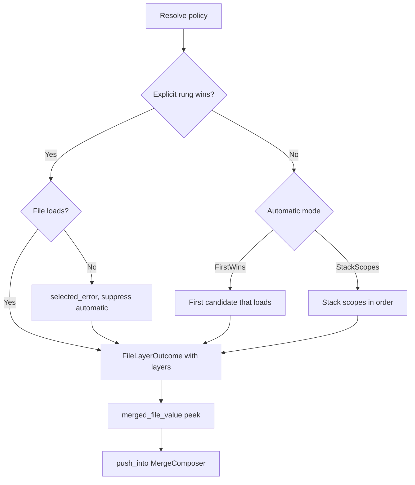

# RFC 0002: Customizable configuration layering policy

## Preamble

- **RFC number:** 0002
- **Status:** Proposed
- **Created:** 2026-06-18

## Summary

OrthoConfig already discovers configuration files and merges them into the
four-layer model of defaults, file, environment, and command-line interface
(CLI) arguments. It does not, however, expose a first-class way to describe
_how_ file layers are selected and stacked. Applications that need a richer
policy must reimplement candidate selection, fail-closed semantics, and
multi-scope stacking by hand, on top of the discovery primitives.

This RFC proposes a generic **file-layer resolution policy** API that sits
between candidate-path generation and the `MergeComposer`. The proposal adds a
small set of additive runtime types — `ConfigPathSelector`, `ExplicitMode`,
`AutomaticMode`, `DiscoveryScope`, `ConfigFilePolicy`, and `FileLayerOutcome` —
plus a resolver entry point and, in a later stage, an extended derive
attribute. The `leynos/netsuke` build tool is used throughout as the proof
case, because its `src/cli/discovery.rs` is exactly the kind of bespoke "config
goblin" the proposed API is meant to absorb.

The guiding boundary is unchanged from OrthoConfig's existing decision record
posture: OrthoConfig owns the generic mechanics, and the downstream application
owns the names and the policy choices. Baking `NETSUKE_CONFIG` or any other
application-specific name into OrthoConfig would recreate a previously rejected
option.

## Problem

OrthoConfig's discovery helper, `ConfigDiscovery`, can enumerate candidate
files across explicit paths, a single environment variable, and the standard
platform directories, then load the first candidate that parses. That model is
a good fit for "pick one configuration file". It is a poor fit for applications
whose file-selection policy is more elaborate.

Netsuke is such an application. Its policy has four distinct behaviours that
the current primitives cannot express directly:

1. **Ordered explicit selection.** The precedence is `--config`, then
   `NETSUKE_CONFIG`, then the legacy `NETSUKE_CONFIG_PATH`, then automatic
   discovery. The current builder accepts only one environment variable, so an
   ordered "first non-empty of three sources" chain cannot be described.
2. **Fail-closed explicit selection.** A selected file that is missing or
   malformed must report that selected-file error and must _not_ fall through
   to automatic discovery. The current `add_required_path` records an error for
   a missing required path, but does not suppress later candidates.
3. **Multi-scope automatic discovery.** When no explicit file is selected,
   user-scope configuration and project-scope configuration must both load,
   with the project scope later in merge order so that project keys override
   user keys while user-only keys survive. The current `compose_layers` returns
   the first successfully loaded chain and stops.
4. **Early access to file layers.** A diagnostics flag (`diag_json`) read from
   the configuration files must be available before the full merge runs, so
   that startup and merge errors are rendered in the correct format. The same
   file layers are therefore needed twice: once early, and once during the
   normal merge.

Because OrthoConfig does not own these behaviours, Netsuke keeps a local module
that re-derives candidate selection, partitions discovery errors by hand,
performs a second manual pass to load the project file, and exposes two nearly
identical entry points so the layers can be resolved twice. That logic is
generic in spirit — none of it depends on Netsuke's domain — yet it lives
downstream because the library offers no seam for it.

## Current state

### OrthoConfig discovery and merge model

The discovery helper lives in `ortho_config/src/discovery/`. A
`ConfigDiscoveryBuilder` collects an application name, an optional single
environment variable, file-name overrides, project roots, and explicit paths
(`ortho_config/src/discovery/builder.rs`). Candidate assembly
(`ortho_config/src/discovery/candidates.rs`) produces an ordered, de-duplicated
list: required explicit paths first (these set a `required_bound`), then
optional explicit paths, then the single environment-variable path, then XDG
Base Directory locations, Windows application-data folders, the home directory,
and finally the project roots.

Layer composition (`ortho_config/src/discovery/load.rs`) is **first-file-wins**:

- `compose_layers()` iterates the candidates and, on the first file whose
  `extends` chain loads, returns that chain as a vector of separate
  `MergeLayer` values and stops. Its result type is
  `DiscoveryLayersOutcome { value, required_errors, optional_errors }`. A
  missing required candidate contributes to `required_errors`; optional
  failures contribute to `optional_errors`.
- The generated loader (`ortho_config_macros/src/derive/load_impl.rs`) calls
  `compose_layers()`, appends `required_errors` unconditionally, appends
  `optional_errors` only when no layer loaded, pushes the resulting file layers
  plus defaults, environment, and CLI layers into a `MergeComposer`, and wraps
  the result in a `LayerComposition`.

`LayerComposition` (`ortho_config/src/declarative/composer.rs`) carries layers
and errors together; `into_merge_result` aggregates any pre-recorded errors
with merge failures, collapsing a single error to itself and multiple errors to
an aggregate. A `MergeLayer` (`ortho_config/src/declarative/layer.rs`) records
a provenance (`Defaults`, `File`, `Environment`, or `Cli`), an owned JSON
value, and an optional file path.

Two facts from this baseline matter for the proposal. First, a required
explicit path can mechanically coexist with later discovered layers even though
the final result errors; the `required_bound` split is used only to _route_
errors, not to _suppress_ probing. Second, the single environment variable is
injected into the automatic candidate list, not into an ordered, exclusive
pre-discovery chain.

### Netsuke's hand-rolled policy

Netsuke's `src/cli/discovery.rs` builds the missing behaviours on top of the
primitives above. The relevant shapes (paraphrased from the current source) are:

```rust,no_run
const CONFIG_ENV_VAR: &str = "NETSUKE_CONFIG";
const CONFIG_ENV_VAR_LEGACY: &str = "NETSUKE_CONFIG_PATH";

// Ordered, fail-closed explicit selection.
fn explicit_config_path(cli: &Cli) -> Option<PathBuf> {
    cli.config
        .clone()
        .or_else(|| env_config_path(CONFIG_ENV_VAR))
        .or_else(|| env_config_path(CONFIG_ENV_VAR_LEGACY))
}

// Either load the selected file exclusively, or discover and stack scopes.
fn push_file_layers(cli: &Cli, composer: &mut MergeComposer, errors: &mut Vec<_>) {
    let layers = explicit_config_path(cli).map_or_else(
        || collect_file_layers(cli.directory.as_deref()),
        |path| load_layers_from_path(&path),
    );
    // ... push layers or record the error ...
}
```

`collect_file_layers` runs `compose_layers()`, partitions the errors itself,
then inspects whether the project file `.netsuke.toml` already appeared among
the discovered layers. When it did not, a second pass loads the project file
and chains those layers _after_ the discovered user-scope layers, so that
project keys win while user-only keys persist. `config_discovery` redirects the
project scope to the `-C/--directory` value with
`clear_project_roots().add_project_root(dir)`. The CLI struct in
`src/cli/parser.rs` documents the intent directly: `--directory` "affects
manifest lookup, output paths, and config discovery", while `--config` is "a
configuration file, bypassing automatic discovery" and is annotated
`#[serde(skip)]` so it does not participate in serialization or layering.

The diagnostics path duplicates the selection logic. `collect_diag_file_layers`
resolves the same selected or discovered layers so that `diag_json` can be read
before the full merge, mirroring `push_file_layers` almost line for line. The
result is correct but repetitive, and the repetition exists only because the
"resolve file layers once, reuse twice" shape is not available from the library.

## Goals and non-goals

- Goals:
  - Provide a generic, additive API that expresses ordered explicit selection,
    fail-closed and exclusive explicit selection, and multi-scope automatic
    stacking, without OrthoConfig knowing any application-specific names.
  - Make "resolve file layers" a first-class, replayable object so the same
    layers can be peeked early and replayed into a `MergeComposer` later
    without re-reading the disk or duplicating selection logic.
  - Classify file-layer outcomes precisely enough to distinguish a fatal
    selected-file failure, an ignorable absent probe, and a reportable
    present-but-invalid file.
  - Preserve the existing public surface. `compose_layers`,
    `DiscoveryLayersOutcome`, `LayerComposition`, `MergeComposer`, and the
    derive output must continue to behave exactly as today.
  - Offer an opt-in derive extension once the runtime API has settled, so
    common policies can be declared rather than wired by hand.
- Non-goals:
  - Encoding any application-specific environment-variable name, file name, or
    flag spelling into OrthoConfig.
  - Adding new search locations. The proposal groups and reorders the existing
    candidate generators; it does not introduce new directories.
  - Custom non-file providers such as databases or remote secret stores. That
    remains future work, tracked separately under the design document's
    custom-sources extension point.
  - Changing the four-layer merge precedence (defaults, file, environment,
    CLI) or the declarative merge strategies.

## Proposed design

### Design boundary

OrthoConfig owns the generic mechanics: ordered selectors, the choice between
fail-closed and fall-through behaviour, and scope stacking. The application
owns the names and the policy: the spelling of `--config`, the `NETSUKE_CONFIG`
chain, the `.netsuke.toml` file name, which scopes exist, and their order.
Every name in the proposed types is therefore an argument supplied by the
caller; no literal an application would choose appears in OrthoConfig.

All new items are additive and live in `ortho_config::discovery`. No existing
signature changes.

### Ordered explicit selector chain

A `ConfigPathSelector` names one source of an explicit path and how to read it.
An ordered slice of selectors is the explicit chain; the resolver walks it and
the first selector that yields a non-empty path wins.

```rust,no_run
/// One rung of an ordered explicit-path selector chain.
///
/// Selectors are resolved in order; the first that yields a non-empty path
/// wins. Under `ExplicitMode::RequiredExclusive` a winning selector also
/// suppresses every later selector and all automatic discovery.
#[non_exhaustive]
pub struct ConfigPathSelector { /* private */ }

impl ConfigPathSelector {
    /// Backed by an already-parsed CLI (or in-memory) optional path.
    pub fn cli(path: Option<impl Into<PathBuf>>) -> Self;

    /// Backed by an environment variable, read at resolve time. An unset or
    /// empty variable is treated as "no selection".
    pub fn env(name: impl Into<Cow<'static, str>>) -> Self;

    /// Override the diagnostic label recorded for this selector.
    pub fn label(self, label: impl Into<Cow<'static, str>>) -> Self;

    /// Mark this selector as a deprecated alias. Resolution is unchanged; the
    /// winning selection records the flag, and OrthoConfig emits a structured
    /// deprecation signal by default (which the application may suppress or
    /// re-render) so that a legacy rung winning is never silent.
    pub fn legacy_alias(self) -> Self;
}
```

The empty-path rule matches the existing environment filter in candidate
assembly and Netsuke's own `env_config_path`: an unset or empty value is not a
selection. A selector chain supersedes the underlying builder's single
`env_var` and its required explicit paths: when a `ConfigFilePolicy` carries
selectors, those builder fields are masked, so the two spellings cannot fight.
The `label` marker carries diagnostics, and OrthoConfig records which labelled
rung won on both the success and the failure path, so an error never hides
which selector chose the offending file.

`ExplicitMode` decides what happens once a rung wins.

```rust,no_run
#[non_exhaustive]
pub enum ExplicitMode {
    /// Fail-closed and exclusive. A winning selector must load; a missing or
    /// malformed file is an error for that path, and automatic discovery does
    /// not run. When no selector matches, automatic discovery runs.
    RequiredExclusive,

    /// Exclusive but tolerant. A winning selector suppresses automatic
    /// discovery, but a missing file is not an error; a malformed file still
    /// is. Yields no file layers when the selected file is absent.
    Optional,
}
```

The following table fixes the semantics precisely. The columns describe the
outcome for each combination of mode and file state.

| Mode                | No rung matches | Rung wins, loads | Rung wins, missing       | Rung wins, malformed |
| ------------------- | --------------- | ---------------- | ------------------------ | -------------------- |
| `RequiredExclusive` | run automatic   | use it, stop     | error on that path, stop | error, stop          |
| `Optional`          | run automatic   | use it, stop     | no layers, stop          | error, stop          |

_Table 1: Explicit-selection semantics by mode and file state._

`RequiredExclusive` is the property that `add_required_path` cannot deliver
today: a matched selector suppresses every later candidate. It maps directly
onto Netsuke's `explicit_config_path(...).map_or_else(discovery, load)` shape.
`Optional` is exclusive-but-tolerant, which is distinct from today's
`add_required_path`, where a selected path is required yet still falls through
to automatic discovery; the policy deliberately does not reproduce that
non-suppressing behaviour, and the derive grammar names it separately rather
than overloading the word "optional" (see the derive section).
`#[non_exhaustive]` leaves room for a future fall-through-required mode without
a breaking change.

### Multi-scope automatic discovery

`AutomaticMode` selects what automatic discovery does once it runs, and
`DiscoveryScope` names a region of the candidate search space.

```rust,no_run
#[non_exhaustive]
pub enum AutomaticMode {
    /// Today's behaviour: scan ordered candidates, take the first file that
    /// loads, emit its `extends` chain, and stop. The default.
    FirstWins,

    /// Load each requested scope independently and concatenate the resulting
    /// layers in scope order, so that later scopes override earlier ones.
    StackScopes,
}

#[non_exhaustive]
pub enum DiscoveryScope {
    /// System directories (`/etc/xdg`, `XDG_CONFIG_DIRS`).
    System,
    /// Per-user directories (`XDG_CONFIG_HOME`, Windows APPDATA, `~/.config`,
    /// the home dotfile).
    User,
    /// Project roots joined with the project file name.
    Project,
}
```

`DiscoveryScope` partitions the _existing_ candidate generators rather than
introducing new locations: the system default XDG path becomes `System`; the
per-user XDG, Windows, and home generators become `User`; the project-root
generator becomes `Project`. Explicit selectors and the builder's single
`env_var` belong to no scope; they resolve through the selector chain, ahead of
any scope. Discovery within any single scope is therefore a slice of today's
order and behaves identically.

`StackScopes` runs first-wins discovery _within_ each scope's candidate
sub-list and appends the winning chain's layers, in `scope_order`. For Netsuke
that yields user-scope layers followed by project-scope layers, which is
exactly "project overrides user, user-only keys survive". `FirstWins` ignores
`scope_order`, scans the full flat candidate list, and is unchanged from today.
The default `scope_order` is `[System, User, Project]`; the Netsuke proof case
exercises only `User` and `Project`.

Two invariants keep scope stacking deterministic, because today's loader
de-duplicates and detects `extends` cycles only _within_ a single chain. First,
`extends` resolution is scope-local: each scope resolves its own chain with its
own visited set, so a parent file is expanded once per scope. Second,
de-duplication is by canonical path _across_ scopes: when two scopes resolve to
the same canonical file (for example, a project root that is a symlink into the
user directory), that file contributes one layer, at its earliest scope
position, rather than loading twice and silently doubling append-strategy
vectors. A cross-scope `extends` cycle is reported with the same cyclic-extends
error as a within-chain cycle.

### Reusable file-layer resolver

The load-bearing requirement is that the same layers are resolved once and
reused. A `ConfigFilePolicy` assembles selectors, modes, scope order, and the
underlying discovery settings; resolving it returns a replayable
`FileLayerOutcome`.

```rust,no_run
/// A declarative file-resolution policy: an ordered explicit-selector chain
/// plus an automatic-discovery fallback, decoupled from application names.
pub struct ConfigFilePolicy { /* private */ }

impl ConfigFilePolicy {
    /// Start from an existing discovery builder (application name, file names,
    /// project roots). Defaults: `RequiredExclusive`, `FirstWins`.
    pub fn new(discovery: ConfigDiscoveryBuilder) -> Self;

    pub fn selectors<I: IntoIterator<Item = ConfigPathSelector>>(self, s: I) -> Self;
    pub fn explicit_mode(self, mode: ExplicitMode) -> Self;
    pub fn automatic_mode(self, mode: AutomaticMode) -> Self;
    pub fn scope_order<I: IntoIterator<Item = DiscoveryScope>>(self, order: I) -> Self;

    /// Redirect project-scope discovery to `dir`, equivalent to
    /// `clear_project_roots().add_project_root(dir)`.
    pub fn project_root(self, dir: impl Into<PathBuf>) -> Self;

    /// Resolve selectors and automatic discovery into a replayable outcome.
    /// Reads the environment once, here. Never returns `Err`: failures are
    /// carried in the outcome's error buckets and realised only when the
    /// outcome is drained or merged.
    pub fn resolve_layers(&self) -> FileLayerOutcome;
}
```

`FileLayerOutcome` is the proposal's central new type. It is a struct rather
than a bare four-arm enum, because a successful chain can coexist with an
earlier ignorable probe, and a fatal selected-file failure must still carry the
winning selector and an empty layer set. The struct therefore holds the ordered
layers, the winning selection, the resolved scope provenance, and three
classified error buckets.

```rust,no_run
/// The replayable, classified result of resolving a `ConfigFilePolicy`. The
/// environment is snapshotted at resolve time, so the peek and the replay
/// always observe the same files even if the environment changes afterwards.
#[must_use]
#[non_exhaustive]
pub struct FileLayerOutcome { /* private */ }

/// Records which selector won and where it pointed. Set on both the success
/// and the failure path, so an error can name the selector that chose the file.
#[non_exhaustive]
pub struct ResolvedSelection { /* private */ }

impl ResolvedSelection {
    pub fn label(&self) -> &str;
    pub fn path(&self) -> &Utf8Path;
    /// True when the winning rung was marked `legacy_alias`.
    pub fn legacy(&self) -> bool;
}

impl FileLayerOutcome {
    /// Fold the resolved file layers into one JSON object for an early,
    /// pre-merge peek of a scalar key (for example, a `diag_json` boolean).
    ///
    /// The fold is computed once, memoised, and shares the object-merge path
    /// the merge engine uses, so it cannot drift. The contract holds for scalar
    /// keys only: a collection-typed key reflects last-file-wins, not the
    /// field's append or keyed-merge strategy, so only scalars should be read.
    ///
    /// `None` does not mean "use the default"; it means no file layer
    /// resolved, which includes the failure case. A caller reading a flag that
    /// governs error rendering must consult `selected_error` and
    /// `reportable_errors` first, and on failure fall back to the most
    /// machine-readable form rather than the human default.
    pub fn merged_file_value(&self) -> Option<&serde_json::Value>;

    /// Replay the resolved layers into a composer, preserving order. This is
    /// the merge-time path; it reads no files, because the layers are already
    /// resolved.
    pub fn push_into(&self, composer: &mut MergeComposer);

    /// The winning explicit selection, set on both success and failure.
    pub fn selection(&self) -> Option<&ResolvedSelection>;

    /// The fatal selected-file error, if any (set under the exclusive modes).
    pub fn selected_error(&self) -> Option<&Arc<OrthoError>>;

    /// Present-but-invalid automatic files, each tagged with its scope.
    pub fn reportable_errors(&self) -> &[(DiscoveryScope, Arc<OrthoError>)];

    /// The resolved file paths in load order, each with its scope, for an
    /// operator "what loaded" trace (compare `git config --show-origin`).
    pub fn origins(&self) -> impl Iterator<Item = (&Utf8Path, DiscoveryScope)>;

    /// Drain the classified errors, in policy order, into a caller-owned
    /// buffer and return the resolved layers — the shape the generated loader
    /// already feeds to `LayerComposition::new`. A `selected_error`, when
    /// present, is the sole drained error; otherwise reportable errors drain
    /// always and ignorable errors only when no layer loaded.
    pub fn into_layers_and_errors(
        self,
        errors: &mut Vec<Arc<OrthoError>>,
    ) -> Vec<MergeLayer<'static>>;

    /// Direct-result convenience that delegates to `into_layers_and_errors`
    /// (and aggregates), so the drain order has a single source of truth.
    pub fn into_result(self) -> OrthoResult<Vec<MergeLayer<'static>>>;
}
```

Internally the outcome holds the ordered file layers (load order: `extends`
parents before children, earlier scopes before later scopes), the winning
`ResolvedSelection`, the per-scope provenance behind `origins`, and three
classified error buckets — a fatal `selected_error`, scope-tagged
`reportable_errors` for present-but-invalid files, and ignorable absent-probe
errors that surface only when no layer loaded.

`ConfigFilePolicy` is the recommended entry point. Two narrower seams keep the
rest of the system unchanged. First, a thin
`ConfigDiscovery::compose_scoped_layers(mode, &scopes) -> DiscoveryLayersOutcome`
gives builder-based callers scope stacking without adopting the policy type.
This is not a full unification: `compose_layers()` scans a single flat
candidate list that interleaves explicit, environment, and platform candidates,
whereas the scoped engine groups the platform generators into scopes and leaves
explicit and environment selection to the selector chain. The legacy
`compose_layers()` is therefore retained unchanged, and `compose_scoped_layers`
is a new sibling that shares the per-scope traversal; they are two tested code
paths, not one path wearing two signatures.

Second, a `From<DiscoveryLayersOutcome>` lift carries a legacy outcome into a
`FileLayerOutcome`. The lift is fold-preserving, not lossless: the legacy type
already collapses "absent" and "present-but-invalid" into one `required_errors`/
`optional_errors` split, so the lift cannot recover the new classification. It
maps `required_errors` to reportable and `optional_errors` to ignorable, which
reproduces the current generated fold exactly, but the absent-versus-invalid
distinction is available only through the native `resolve_layers` path. A
malformed file lifted through `From` therefore behaves exactly as today; it
does not gain the "surface regardless" treatment.

Relative paths resolve against the process working directory, except that a
`project_root` set from `-C/--directory` rebases project-scope discovery; an
error always renders the fully resolved path, so an operator is never shown a
bare relative name they cannot locate.

### File-layer error policy

The four file outcomes Netsuke cares about map onto the `FileLayerOutcome`
fields as follows.

| Outcome                  | Winning source        | Error bucket        | Surfacing rule                                |
| ------------------------ | --------------------- | ------------------- | --------------------------------------------- |
| Selected explicit failed | explicit selector     | `selected_error`    | always; automatic discovery never ran         |
| Optional probe absent    | automatic or none     | `ignorable_errors`  | only when no layers loaded and no other error |
| Present but invalid      | automatic scope       | `reportable_errors` | always, even when another layer loaded        |
| Chain succeeded          | explicit or automatic | none                | layers preserved in load order                |

_Table 2: File-layer outcomes and how they surface._

The `reportable_errors` bucket is the genuinely new expressiveness. Today a
malformed _automatic_ file lands in `optional_errors` and is dropped whenever a
later candidate succeeds, so a broken project file can vanish behind a valid
user file. Distinguishing "absent" (ignorable) from "present but invalid"
(reportable) at the type level lets the malformed file surface regardless.

Draining follows a fixed precedence that mirrors the current loader fold while
making it type-checked: a `selected_error`, when present, is the sole surfaced
error and the layers are empty; otherwise reportable errors always surface, and
ignorable errors surface only when no layers loaded. Because
`into_layers_and_errors` appends to the same error buffer the loader already
maintains, and `LayerComposition::into_merge_result` already aggregates
pre-recorded errors with merge failures, the classification flows through the
existing aggregation collapse without any change to `LayerComposition`.

A present-but-invalid file in a participating scope is fatal: the merge does
not quietly proceed with the remaining valid layers and discard the broken
file. The error names the offending scope, and when several such errors (or a
merge error) coexist they aggregate with their scope labels intact, so an
operator can tell a malformed project file from a malformed user file.

The suppression gate removes the "uncanny" coexistence noted in the current
state. Under `ExplicitMode::RequiredExclusive`, when an explicit selector wins,
the resolver loads exactly that path's `extends` chain through a single-path
loader and never enumerates the automatic generators at all; the gate lives at
candidate generation, not after it, so a required path can no longer
mechanically coexist with later discovered layers. A failure then yields a
single terminal `selected_error` that carries the winning `ResolvedSelection`,
and `into_merge_result` returns that one error rather than an aggregate —
matching Netsuke's "report that error" contract, and naming the selector (for
example, the deprecated `NETSUKE_CONFIG_PATH`) that chose the file. The legacy
`compose_layers()` keeps its current non-suppressing behaviour; suppression is
reached only through the new policy.

### Behaviour mapping

The following screen-reader description precedes a worked mapping: it shows the
Netsuke policy expressed once as a `ConfigFilePolicy`, then used at two call
sites — an early diagnostics peek and the merge-time push — replacing the
current pair of near-identical functions.

```rust,no_run
fn policy(cli: &Cli) -> ConfigFilePolicy {
    let mut p = ConfigFilePolicy::new(ConfigDiscovery::builder("netsuke"))
        // Behaviour 1 and 2: ordered, fail-closed, exclusive selector chain.
        .selectors([
            ConfigPathSelector::cli(cli.config.clone()).label("--config"),
            ConfigPathSelector::env("NETSUKE_CONFIG"),
            ConfigPathSelector::env("NETSUKE_CONFIG_PATH").legacy_alias(),
        ])
        .explicit_mode(ExplicitMode::RequiredExclusive)
        // Behaviour 3: stack user then project scopes.
        .automatic_mode(AutomaticMode::StackScopes)
        .scope_order([
            DiscoveryScope::System,
            DiscoveryScope::User,
            DiscoveryScope::Project,
        ]);
    // Behaviour 4 (the part static attributes cannot reach): the project root
    // comes from a parsed CLI field.
    if let Some(dir) = cli.directory.as_deref() {
        p = p.project_root(dir);
    }
    p
}

// Resolve once (snapshotting the environment); reuse twice.
let outcome = policy(cli).resolve_layers();

// Early diagnostics peek (replaces `collect_diag_file_layers`). On a failed
// resolution, force the most machine-readable rendering rather than the human
// default, so a broken config does not also break its own diagnostics.
let file_diag_json = if outcome.selected_error().is_some() {
    Some(true)
} else {
    outcome
        .merged_file_value()
        .and_then(|v| v.get("diag_json"))
        .and_then(serde_json::Value::as_bool)
};

// Merge time (replaces `push_file_layers`). No second disk read.
outcome.push_into(&mut composer);
```

The whole of `collect_file_layers`, `push_file_layers`,
`collect_diag_file_layers`, `explicit_config_path`, and `load_layers_from_path`
collapses to one policy constructor and two call sites. The exclusive selector
chain, the fail-closed error, the user-plus-project stacking, and the
de-duplication of an already-included project layer all move into
`resolve_layers`.

### Resolution flow

The following screen-reader description precedes the diagram: a flowchart shows
resolution starting at the explicit selector chain, branching on whether a rung
wins, applying fail-closed handling under exclusive mode, otherwise running
automatic discovery in either first-wins or scope-stacking form, and finally
producing a `FileLayerOutcome` that is peeked and then replayed.



_Figure 1: File-layer resolution from policy to replay._

### Derive-macro extension

The derive macro already supports `#[ortho_config(discovery(...))]` with keys
such as `app_name`, a single `env_var`, file names, and the generated
`--config` flag controls. The extension adds keys that express the new
behaviours, while preserving the existing defaults exactly.

```rust,no_run
#[ortho_config(discovery(
    app_name = "netsuke",
    config_cli_long = "config",
    config_cli_visible = true,
    env_vars = ["NETSUKE_CONFIG", "NETSUKE_CONFIG_PATH"],
    explicit_mode = "required_exclusive",
    automatic_mode = "stack_scopes",
    project_file_name = ".netsuke.toml",
    project_root_from = "directory",
))]
```

- `env_vars = [..]` is an ordered alias chain; index zero is canonical and
  later entries are legacy aliases. Setting both `env_var` and `env_vars` is a
  compile error, because the combined precedence would be ambiguous; `env_var`
  remains the single-variable shorthand.
- `explicit_mode` and `automatic_mode` accept the string forms of the runtime
  enum variants. Their defaults reproduce the current behaviour, but the
  default explicit mode is named `fallthrough` (today's
  required-but-non-suppressing path), not `optional`, so the macro string never
  contradicts the runtime `ExplicitMode::Optional`, which is
  suppress-but-tolerant. The default automatic mode is `first_wins`.
- `scope_order` lists scopes by name and is validated at compile time.
- `project_root_from = "field"` is the key that reaches a runtime-parsed value.
  The generated loader already reads `cli.config_path` off the parsed CLI
  struct; this key lowers to the same move against another field, emitting a
  read of `cli.directory` to feed the project-scope root. The macro validates
  at compile time that the named field exists, is a `PathBuf` or
  `Option<PathBuf>`, and is a parsed CLI argument rather than a `skip_cli`
  field. The argument names the Rust field identifier, not the serde rename,
  because the wiring is code-level and has no configuration-surface presence.

The static grammar cannot express every policy — a root derived from two
fields, or conditional scopes. For those, the runtime `ConfigFilePolicy` is
already the escape hatch: an application builds one by hand and bypasses the
derive entirely. A dedicated derive hook (a `policy_hook` flag, parsed like the
existing `post_merge_hook`, lowering to a `ConfigPolicy` trait the loader
calls) is therefore deferred to a follow-up, to be added only when a second
consumer needs declarative access to an imperative policy. Keeping it out of
this RFC avoids speculative macro surface for a hypothetical caller.

The derive extension is deliberately staged last (see the delivery plan):
`explicit_mode`, `automatic_mode`, and `scope_order` are renamings of runtime
enum variants and must not be frozen before the runtime types settle, and the
extension should ideally wait for a second consumer so the attribute grammar is
shaped by more than one application. The compile-time field-reference machinery
behind `project_root_from` is the riskiest novel piece; its parser and
diagnostics can be developed and soaked independently of the runtime resolver.

## Requirements

### Functional requirements

- An ordered chain of explicit selectors resolves to the first selector that
  yields a non-empty path; a CLI value and an environment variable are both
  expressible as selectors.
- Under exclusive explicit mode, a winning selector suppresses all automatic
  discovery, and a missing or malformed selected file produces a single
  terminal error rather than an aggregate.
- Automatic discovery can either take the first file that loads or stack
  multiple scopes in a caller-defined order, with later scopes overriding
  earlier ones and `extends` chains preserved as separate layers.
- A resolved outcome can be peeked (a merged file value for early reads) and
  replayed into a `MergeComposer` without re-reading files.
- A present-but-invalid automatic file surfaces as an error even when a later
  file loads; an absent automatic probe is surfaced only when discovery is
  exhausted.
- The project scope can be rooted at a path obtained from a parsed CLI field.
- A resolved outcome exposes which files loaded, in order, with their scope, so
  an application can offer an operator-facing "what configuration loaded" trace.
- The environment is read once, at resolve time; the peek and the replay of a
  single outcome observe the same files regardless of later environment changes.

### Technical requirements

- All new items are additive and reside in `ortho_config::discovery`. The
  signatures and behaviour of `compose_layers`, `compose_layer`, `load_first*`,
  `DiscoveryLayersOutcome`, `LayerComposition`, `MergeComposer`, and
  `MergeLayer` are unchanged.
- New enums carry `#[non_exhaustive]` so future variants remain non-breaking,
  and new structs (`ConfigPathSelector`, `ConfigFilePolicy`, `FileLayerOutcome`,
  `ResolvedSelection`) keep private fields behind accessors with
  `#[non_exhaustive]` so their field sets can grow non-breakingly.
- A fold-preserving `From<DiscoveryLayersOutcome>` lift and an
  `into_layers_and_errors` drain reproduce the current generated loader fold
  exactly for existing callers; the absent-versus-invalid classification is
  available only through `resolve_layers`, never retrofitted onto the lift.
- The release is verified as additive with `cargo-semver-checks` and a
  `cargo-public-api` snapshot before publishing.
- The derive extension preserves the current generated loader verbatim for
  structs that set only existing keys, branching to a new emitter only when a
  new key is present.

## Compatibility and migration

OrthoConfig is a pre-1.0 crate that follows semantic versioning (SemVer) with
caret dependency requirements, and owns compatibility for its reusable
contracts. The proposal is additive, so it warrants a minor release under the
pre-1.0 rules, where the minor position is the compatibility boundary. No
existing public item changes signature or semantics; the only environment-level
behaviour the existing single `env_var` builder field cannot express — an
ordered, exclusive, multi-variable chain — is delivered through the new
selector type rather than by changing the field, precisely to avoid a breaking
change to candidate ordering.

Netsuke's migration is mechanical and preserves its existing test contracts.
The local helpers map onto the new API as follows.

| Netsuke helper                             | Replaced by                                          |
| ------------------------------------------ | ---------------------------------------------------- |
| `explicit_config_path`                     | a `ConfigPathSelector` chain in selector order       |
| `load_layers_from_path`                    | `resolve_layers` under `RequiredExclusive`           |
| `collect_file_layers` / `push_file_layers` | `FileLayerOutcome::into_layers_and_errors` then push |
| `collect_diag_file_layers`                 | `merged_file_value` on the single resolved outcome   |

_Table 3: Netsuke helper-to-API migration map._

The existing Netsuke test cases translate into outcome assertions:
selected-file fail-closed becomes an assertion that the selection won,
automatic discovery was suppressed, and a single selected error surfaced;
env-alias precedence becomes a selector-chain ordering test; user-plus-project
stacking becomes an assertion on layer order by scope; a malformed project file
becomes an assertion that it appears among the reportable errors even when the
user file loaded; `extends` ordering becomes an assertion on
parent-before-child order within each scope and user-before-project order
across scopes; and project root from `-C/--directory` becomes an assertion on
the resolved project-layer path. Netsuke pins the new minor and adopts the
richer outcome incrementally; nothing it currently relies on is removed.

### Stability surface

Several contracts freeze at the first release that ships them and must be
settled before that release:

- The field posture of every new struct. `ConfigPathSelector`,
  `ConfigFilePolicy`, `FileLayerOutcome`, and `ResolvedSelection` ship with
  private fields, accessor methods, and `#[non_exhaustive]`, so fields can be
  added later; this must be in place before the first minor, because public
  fields are a one-way door.
- The derive attribute strings (`required_exclusive`, `fallthrough`,
  `stack_scopes`, `first_wins`, `system`/`user`/`project`) become a public
  grammar that can only change through a deprecation cycle once shipped, which
  is why the derive extension is staged last.
- The drain precedence of `into_layers_and_errors` (selected error sole, else
  reportable always, else ignorable when empty) and its single-versus-aggregate
  collapse become observable the moment a downstream test asserts on them.
- The scalar-only guarantee of `merged_file_value`. It ships narrow; widening it
  later is safe, but broadening the claim and then narrowing it is not.

## Alternatives considered

### Option A: Bake the policy into OrthoConfig

OrthoConfig could grow Netsuke's exact policy — the `NETSUKE_CONFIG` chain, the
`.netsuke.toml` project pass — as built-in behaviour. This is the option the
project's existing decision-record posture already rejects: it turns a general
configuration library into a Netsuke-shaped keyhole, forces every other
consumer to inherit one application's flag spellings, and couples library
releases to one application's policy changes. It is recorded here only to be
explicitly set aside.

### Option B: Leave the policy downstream

The status quo keeps the policy in Netsuke's `src/cli/discovery.rs`. It works,
but it requires every consumer with a non-trivial file policy to reimplement
candidate selection, error partitioning, multi-scope stacking, and a
resolve-twice seam. The logic is generic, so duplicating it downstream is pure
cost, and the subtle parts (fail-closed suppression, present-but-invalid
surfacing) are easy to get wrong in each reimplementation.

### Option C: Generic selector and scoped-layer policy

The recommended option adds the generic mechanics to OrthoConfig and leaves the
names and policy choices with the application. It draws on established prior
art for layered configuration: Figment's provenance-tracked merge and join
semantics, on which OrthoConfig already builds
([Figment documentation](https://docs.rs/figment/latest/figment/)); Cargo's
hierarchical configuration, which merges files discovered from the working
directory upward with deeper directories taking precedence
([the Cargo book](https://doc.rust-lang.org/cargo/reference/config.html));
Git's ordered configuration scopes of system, global, local, and worktree with
later scopes winning and an explicit scope-origin display
([git-config documentation](https://git-scm.com/docs/git-config)); Viper's
`SetConfigFile`, which forces an explicit file and disables search; and
cosmiconfig's distinction between an explicit `load` and a scoped `search`. The
proposal generalizes these into selectors (explicit, ordered, optionally
exclusive) and scopes (stacked, ordered), without copying any one tool's
naming. Reusing Figment's own profile and provider merge directly was
considered and set aside: OrthoConfig deliberately explodes each `extends`
chain into separate layers so its field-level append and keyed-merge strategies
apply across the chain, which Figment's leaf-replacement merge would defeat.
The new policy therefore composes `MergeLayer` values rather than delegating to
Figment profiles.

| Topic                   | Option A | Option B | Option C |
| ----------------------- | -------- | -------- | -------- |
| Owns application names  | library  | app      | app      |
| Reuse across consumers  | none     | none     | high     |
| Fail-closed exclusivity | built-in | manual   | generic  |
| Multi-scope stacking    | built-in | manual   | generic  |
| Resolve-once reuse      | built-in | manual   | built-in |
| Breaking change risk    | high     | none     | none     |

_Table 4: Comparison of layering-policy ownership options._

### Option D: A single trait-based resolver seam

Option D shares Option C's ownership split but differs in shape. Instead of
composing selectors, modes, and scopes as data, the application implements one
trait method —
`FileLayerProvider::resolve(&self, &Candidates) -> FileLayerOutcome` — and
writes its policy as ordinary control flow, with the library supplying
combinators (`explicit_first_of`, `load_exclusive`, `stack`). This collapses
the mode and scope enums into a few combinator methods and makes the escape
hatch the front door, so no policy is ever unreachable. It is rejected for one
decisive reason: OrthoConfig's identity is _declared_ configuration from a
struct. A policy expressed only as imperative trait code cannot be lowered from
a derive attribute, and cannot be read back by the generated agent-context and
documentation tooling the crate already ships. The declarative form is chosen
precisely because the policy must be inspectable and derivable, not merely
executable. The combinator insight is retained internally: the declarative
resolver is built on a shared per-scope traversal core, so a future
`policy_hook` and the declarative path use one engine.

## Open questions

- Should `ExplicitMode` ship a third, fall-through-required variant (a selected
  file that must load if present but still permits discovery when absent), or
  is that better deferred behind `#[non_exhaustive]` until a consumer needs it?
- Should scope provenance also be carried per layer (a new `MergeProvenance`
  variant, which `#[non_exhaustive]` permits) in addition to the outcome-level
  `origins`, so a key can be traced to a scope after merging?
- Should `DiscoveryScope::System` ship now, given the proof case stacks only
  `User` and `Project`, or wait behind `#[non_exhaustive]` for a consumer that
  stacks system configuration?
- When the same canonical file is reachable from two scopes, the proposal keeps
  it at its earliest scope position; should last-position ever be configurable,
  or is earliest-wins a sufficient fixed rule?

## Recommendation

Adopt Option C and deliver it in stages, runtime first. The runtime types and
resolver give Netsuke a clean, native path that removes its bespoke discovery
module, while keeping OrthoConfig free of any application-specific name. The
derive extension follows once the runtime API has settled, so its
attribute-string forms are not frozen against unsettled enum names. The change
is additive, verifiable as such with SemVer tooling, and directly addresses the
four behaviours that motivated the RFC.

## Delivery plan

The work decomposes into atomic, dependency-ordered steps suitable for a
roadmap entry. Each step is additive and individually mergeable.

1. **Add runtime types.** Introduce `ConfigPathSelector`, `ExplicitMode`,
   `AutomaticMode`, `DiscoveryScope`, `ResolvedSelection`, and
   `FileLayerOutcome` (all `#[non_exhaustive]` with accessor methods), the
   fold-preserving `From<DiscoveryLayersOutcome>` lift, and the
   `into_layers_and_errors` and `into_result` drains. Acceptance: the four-case
   mapping in Table 2 is unit-tested, and a golden fixture in this step proves
   the lift reproduces the current loader fold exactly — the safety net lands
   with the change, not at the end.
2. **Add scoped resolution.** Add `compose_scoped_layers` and the
   `ConfigFilePolicy` resolver with the suppression gate and environment
   snapshotting. Acceptance: a `RequiredExclusive` win probes no automatic
   candidate (verified against a filesystem spy); `compose_layers` remains
   unchanged and green; and a test mutating the environment between a peek and
   a replay of one outcome asserts identical file provenance.
3. **Add the explicit selector chain.** Add the ordered selector resolution and
   the `--config` then `NETSUKE_CONFIG` then `NETSUKE_CONFIG_PATH` shape, named
   only by the caller. Acceptance: first present selector wins and suppresses
   the rest.
4. **Add derive attributes.** Once the runtime API has settled, surface
   `env_vars`, `explicit_mode`, `automatic_mode`, `scope_order`,
   `project_root_from`, and `policy_hook`, with the compile-time validations.
   Acceptance: default structs generate the current loader verbatim; opt-in
   structs route through the new resolver.
5. **Add the test matrix and migration validation.** Cover selected-file
   fail-closed (missing and malformed) with the selector named in the error, no
   automatic probe under suppression, optional probe absent with a later
   success, optional probes exhausted, present-but-invalid surfacing despite a
   later success, user-plus-project stacking order, `extends` ordering within
   and across scopes, the same canonical file reached from two scopes loading
   once (append vectors not doubled), relative-path resolution against the
   working directory versus `-C/--directory`, env-alias precedence, a legacy
   alias winning and emitting the default deprecation signal, the operator
   `origins` trace, project root from a CLI field, the aggregation collapse,
   and the SemVer additivity guard. (The back-compat lift fixture lands in step
   1.)
